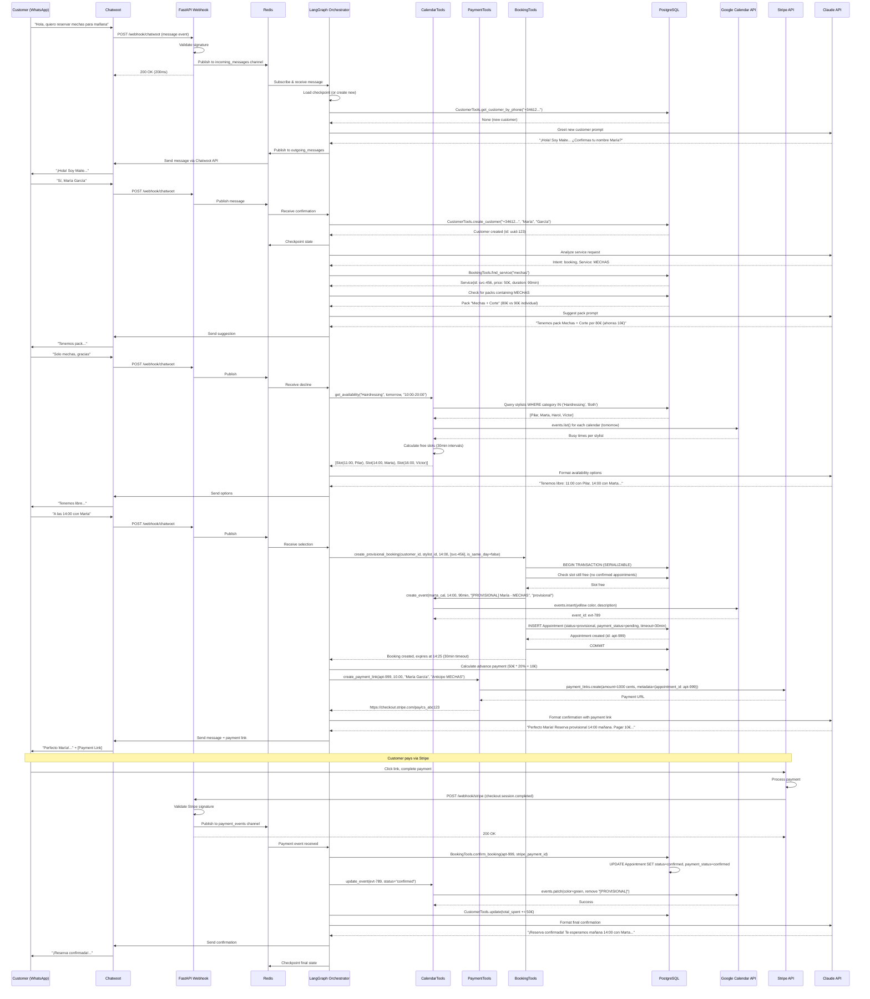

# 7. Core Workflows

This section illustrates key system workflows using sequence diagrams to show component interactions, including external APIs, error handling paths, and async operations.

## 7.1 Standard Booking Flow (Scenario 1: New Customer Booking)

---
