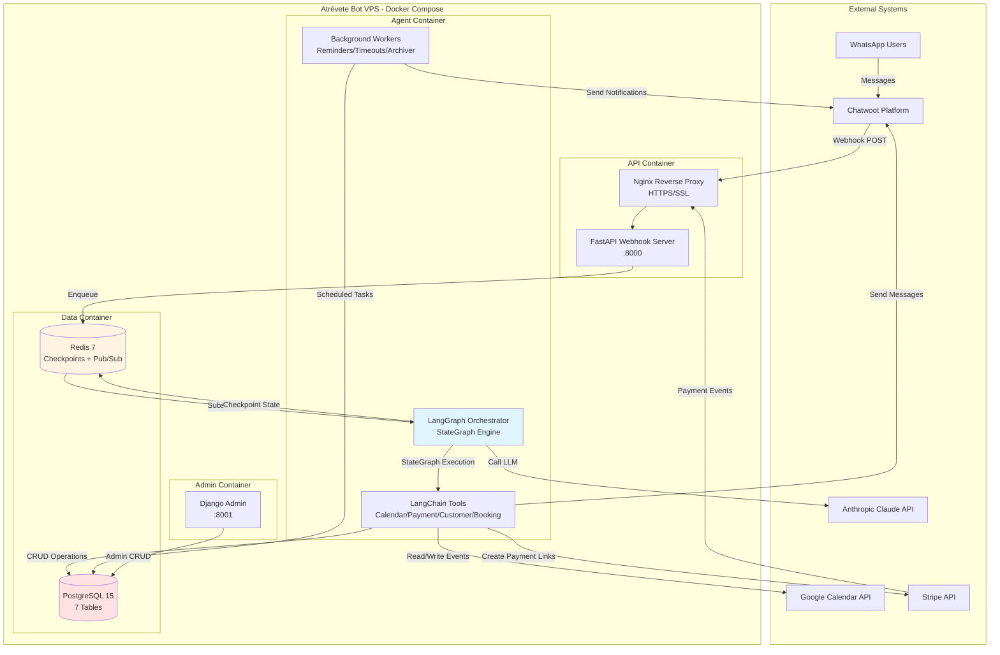

# 2. High Level Architecture

## 2.1 Technical Summary

Atrévete Bot implements a **stateful conversational AI architecture** deployed as a monolithic application across 3 specialized Docker containers. The backend leverages **LangGraph 0.6.7+** for orchestrating complex multi-step conversational flows with automatic checkpointing, integrated with **Anthropic Claude** (Sonnet 4) for natural language understanding and reasoning. The system uses **FastAPI** for async webhook handling (Chatwoot/Stripe), **PostgreSQL** for relational data persistence, and **Redis** for hot-state management and pub/sub messaging. WhatsApp serves as the primary customer interface via **Chatwoot**, while a lightweight **Django Admin** interface enables salon staff to manage business data (services, packs, policies, holidays). The architecture implements atomic transaction-based booking with provisional calendar blocks, Stripe-hosted payment processing, intelligent escalation to human team members, and automated reminder/timeout workers. This design achieves the PRD's 85%+ automation goal by combining LangGraph's stateful orchestration capabilities with defensive concurrency controls, comprehensive error handling, and crash-recovery mechanisms—all while maintaining <5s response times for standard queries and 99.5% uptime.

## 2.2 Platform and Infrastructure Choice

**Platform:** VPS (Virtual Private Server) with Docker Compose
**Provider Recommendation:** Hetzner Cloud, DigitalOcean, or Linode
**Key Services:**
- **Compute:** 4GB RAM / 2 vCPU VPS (CPX21 equivalent)
- **Storage:** 50GB SSD for PostgreSQL data and logs
- **Networking:** HTTPS via Nginx reverse proxy with Let's Encrypt SSL
- **Backups:** Daily PostgreSQL backups to object storage (S3/Spaces)
- **Monitoring:** Self-hosted (Prometheus/Grafana) or cloud (BetterStack/UptimeRobot)

**Deployment Host and Regions:** Europe (Germany/Netherlands) for GDPR compliance and low latency to Spain (Europe/Madrid timezone)

## 2.3 Repository Structure

**Structure:** Monorepo with organized folder structure

**Monorepo Tool:** None (simple folder structure sufficient for MVP; consider Nx/Turborepo if expanding to multi-language/multi-app)

**Package Organization:** Logical separation by layer (api, agent, database, admin) with shared dependencies in root `requirements.txt`

## 2.4 High Level Architecture Diagram

## 2.5 Architectural Patterns

- **Stateful Agent Orchestration (LangGraph StateGraph):** Core orchestration pattern for 18 conversational scenarios with automatic checkpointing, conditional routing, and crash recovery - _Rationale:_ Enables complex multi-step flows with branching logic (pack suggestions, escalation, timeouts) while maintaining conversation context across crashes/restarts; superior to manual state machines for AI-driven workflows

- **Event-Driven Messaging (Redis Pub/Sub):** Decouples webhook receivers from agent processing via asynchronous message queues - _Rationale:_ Webhooks must return 200 OK immediately (<3s) while LangGraph conversations can take 5-10s; pub/sub enables fast webhook acks and scalable async processing

- **Repository Pattern (SQLAlchemy ORM):** Abstract data access logic through dedicated tool classes (CustomerTools, BookingTools) - _Rationale:_ Enables testing with mocked databases, future migration flexibility (e.g., PostgreSQL → CockroachDB), and clean separation between business logic (LangGraph nodes) and persistence

- **Two-Phase Commit for Bookings (Provisional → Confirmed):** Atomic state transitions with timeout-based rollback - _Rationale:_ Prevents double-booking race conditions by creating provisional Google Calendar blocks with 30min TTL, upgrading to confirmed only after payment webhook validation; implements optimistic locking without distributed transactions

- **Intelligent Escalation with Human-in-the-Loop:** LangGraph interrupt mechanism pauses bot, notifies team via WhatsApp, and sets Redis flag to prevent bot re-entry - _Rationale:_ Medical consultations, payment failures, and ambiguity require human judgment; interrupt pattern enables graceful handoff without losing conversation context

- **Tool-Augmented LLM (ReAct Pattern):** Claude reasons about which tools to call based on conversation state, with LangGraph enforcing deterministic control flow - _Rationale:_ Balances flexibility (LLM chooses calendar slots, suggests packs) with safety (payment flows follow strict node sequences); reduces hallucination risk by grounding responses in real data

- **Backend for Frontend (Admin Panel):** Django Admin serves as lightweight BFF for salon staff CRUD operations - _Rationale:_ Auto-generated forms reduce development time; read-only calendar views prevent accidental conflicts with bot-managed bookings; staff don't need direct database access

- **Defensive Concurrency Control (Atomic DB Transactions):** PostgreSQL row-level locking for appointment writes with serializable isolation - _Rationale:_ Concurrent customers booking same slot require atomic checks (is slot still free?) and writes (create provisional block); prevents double-booking without distributed locks

---
