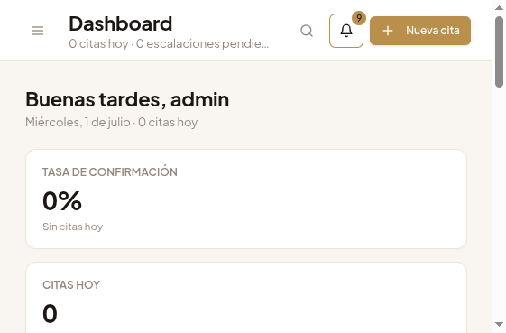
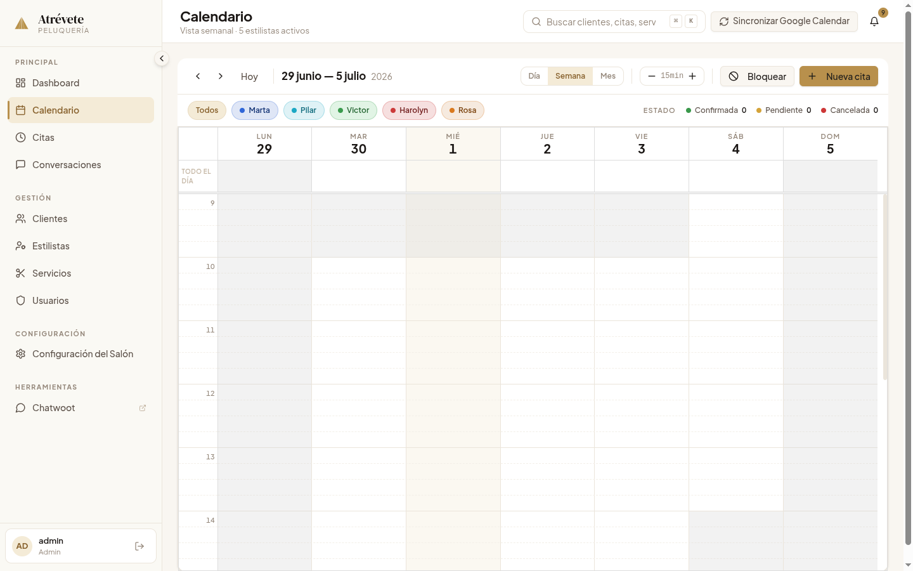
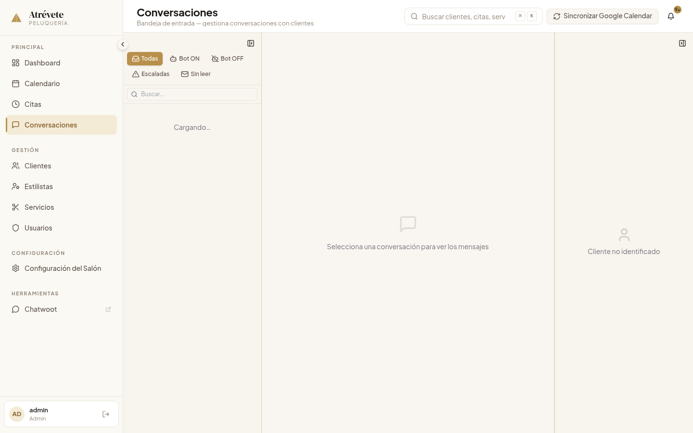

# Atrévete Bot

AI-powered WhatsApp booking assistant for a beauty salon, built with LangGraph, GPT-4.1-mini (via OpenRouter), and FastAPI.

## Overview

Atrévete Bot handles customer bookings via WhatsApp through Chatwoot, managing appointments across 5 stylists using a DB-first calendar architecture with Google Calendar as a push-only mirror. The agent is a single LLM tool-calling loop built on LangGraph's `create_agent`, wrapped in a custom 8-middleware pipeline that hydrates context (customer identity, appointment history, live availability) into the system prompt on every turn — and scans every reply for groundedness violations before it ships.

**Key Features:**
- **Middleware-Pipeline Agent** — 8 composable middlewares (identity disclosure, customer resolution, appointment context, dynamic prompts, availability injection, prompt assembly, summarization, response groundedness) around a single tool-calling loop
- **Response Groundedness Checks** — post-hoc scan of every assistant reply against business facts to catch hallucinated availability, prices, or policies
- **DB-First Calendar** — PostgreSQL as source of truth, <100ms availability checks (vs 2–5s via Google Calendar API), with Google Calendar as an async push-only mirror
- **GDPR Consent Gate** — privacy-policy acceptance wired into the booking flow, with a versioned consent audit trail per customer
- **Automated Confirmation Lifecycle** — 48h confirmation requests, final warnings, and flag-gated auto-cancel via a notifications worker
- **Redis Streams** — message delivery with acknowledgment and idempotency checks
- **Next.js Admin Panel** — full CRUD, real-time calendar, conversation inbox with operator takeover, and dashboard analytics
- **375 test files** (unit, integration, and a declarative E2E QA harness that drives the live bot pipeline)

## Screenshots

**Dashboard — KPIs and daily activity:**



**Real-time calendar — multi-stylist week view:**



**Conversation inbox — operator takeover and bot pause/resume:**



## Quick Start

### 1. Clone & Configure

```bash
git clone <repository-url>
cd atrevete-bot
cp .env.example .env
# Edit .env with your API keys
```

### 2. Setup Environment

```bash
# Python
python3.11 -m venv venv
source venv/bin/activate
pip install -r requirements.txt

# Admin Panel
cd admin-panel && npm install && cd ..
```

### 3. Run Services

```bash
docker-compose up -d
docker-compose ps
```

### 4. Access Services

- **Admin Panel**: http://localhost:3001 (Next.js)
- **API Docs**: http://localhost:8000/docs

## Architecture

### Agent Pipeline

The agent is LangGraph's `create_agent` with a custom middleware stack (single source of truth: `agent/agent_factory.py`):

```
Message Arrives (Redis Streams)
    ↓
DisclosureMiddleware          → AI-disclosure compliance
CustomerResolveMiddleware     → phone → customer identity
AppointmentContextMiddleware  → active appointments into context
DynamicPromptMiddleware       → per-turn prompt sections
AvailabilityContextMiddleware → live slot availability injection
PromptAssemblyMiddleware      → assembles XML-fenced system prompt
SummarizeMiddleware           → long-conversation compression
    ↓
LLM tool-calling loop (booking, availability, appointment management, escalation)
    ↓
ResponseGroundednessMiddleware → scans reply for ungrounded claims
    ↓
Response → Chatwoot → WhatsApp
```

**Key Principles:**
- **Middlewares hydrate, tools act** — context injection is separated from state mutation
- **Tool-driven state** — tools declare state changes; no direct state mutation
- **Checkpointed conversations** — Redis-backed LangGraph checkpoints per conversation thread

### DB-First Calendar Architecture

PostgreSQL is the source of truth for availability. Google Calendar is a push-only mirror:

```
Availability Check (read):  PostgreSQL query → <100ms
Booking (write):            DB commit → async Google Calendar push (with retry + sync-status tracking)
```

## Project Structure

```
atrevete-bot/
├── agent/                     # LangGraph agent
│   ├── agent_factory.py       # build_conversation_agent: create_agent + tools + middleware
│   ├── middleware/            # 8-middleware pipeline (see Architecture)
│   ├── prompts/               # System prompts (identity, rules, glossary, booking flow)
│   ├── tools/                 # LangChain tools (booking, availability, management, escalation)
│   ├── services/              # Business logic (availability, Google Calendar push)
│   └── workers/               # Background workers (notifications, archiver)
│
├── api/                       # FastAPI webhook receiver
│   ├── routes/                # Chatwoot webhook + admin API endpoints
│   └── services/              # Business logic services
│
├── database/                  # SQLAlchemy models & Alembic migrations
├── admin-panel/               # Next.js 15 admin interface (App Router)
├── shared/                    # Config, Chatwoot client, Redis client, logging
├── tests/                     # 375 test files: unit, integration, E2E QA harness
├── docker/                    # Docker configurations
└── docs/                      # PRDs, architecture decisions, QA screenshots
```

## Technology Stack

### Backend
- **Agent:** LangGraph 0.6.7+, LangChain 0.3.0+, GPT-4.1-mini via OpenRouter
- **API:** FastAPI 0.116.1, Pydantic 2.x, Uvicorn 0.30.0+
- **Database:** PostgreSQL 15+, SQLAlchemy 2.0+ (asyncpg), Alembic 1.13+
- **Cache:** Redis Stack (RedisSearch, RedisJSON, Streams)
- **Observability:** Langfuse tracing, structured JSON logging with PII masking
- **External APIs:** Google Calendar API, Chatwoot API

### Frontend (Admin Panel)
- **Framework:** Next.js 15 (App Router), React 18
- **Styling:** Tailwind CSS + shadcn/ui + Radix UI primitives
- **Tables:** TanStack React Table · **Calendar:** FullCalendar

### Development Tools
- **Testing:** pytest 8.3.0+, pytest-asyncio (85% coverage minimum), declarative E2E scenario runner
- **Quality:** black, ruff, mypy

## Common Commands

### Database
```bash
DATABASE_URL="postgresql+psycopg://..." alembic upgrade head   # Apply migrations
docker exec -it atrevete-postgres psql -U atrevete -d atrevete_db
```

### Testing
```bash
DATABASE_URL="postgresql+asyncpg://..." pytest           # All tests
DATABASE_URL="postgresql+asyncpg://..." pytest --cov     # With coverage
```

### Code Quality
```bash
black .        # Format
ruff check .   # Lint
mypy .         # Type check
```

### Docker
```bash
docker-compose up -d          # Start all services
docker-compose logs -f agent  # View agent logs
```

### Admin Panel
```bash
cd admin-panel
npm run dev      # Development server
npm run build    # Production build
```

## Key Features

### Implemented ✅
- **Multi-stylist booking** — 5 stylists with individual Google Calendars
- **DB-first availability** — PostgreSQL as source of truth (<100ms queries)
- **Google Calendar sync** — push-only mirror with retry and per-appointment sync status
- **Confirmation lifecycle** — 48h confirmation requests, reminders, flag-gated auto-cancel
- **GDPR consent gate** — versioned policy acceptance with audit trail
- **Blocking events & holidays** — stylist-specific unavailability and salon-wide closures
- **Conversation inbox** — operator takeover, bot pause/resume, WhatsApp 24h-window awareness
- **Redis Streams** — message delivery with acknowledgment and idempotency
- **JWT authentication** — secure admin access
- **Dashboard analytics** — KPIs + charts
- **Service catalog integrity guard** — CI-enforced structural invariants over the service catalog

## Documentation

- **[docs/](docs/)** — product requirements, architecture decisions, and system docs
- **[.env.example](.env.example)** — environment variable template

This repository is developed with an AI-assisted workflow: a progressive-disclosure documentation system (root and per-component `AGENTS.md` files, `CLAUDE.md` operational guide, and auto-invoked skills under `skills/`) gives coding agents precise, component-scoped context.

---

**Proprietary client project — all rights reserved. Published as a portfolio reference; not licensed for reuse.**
