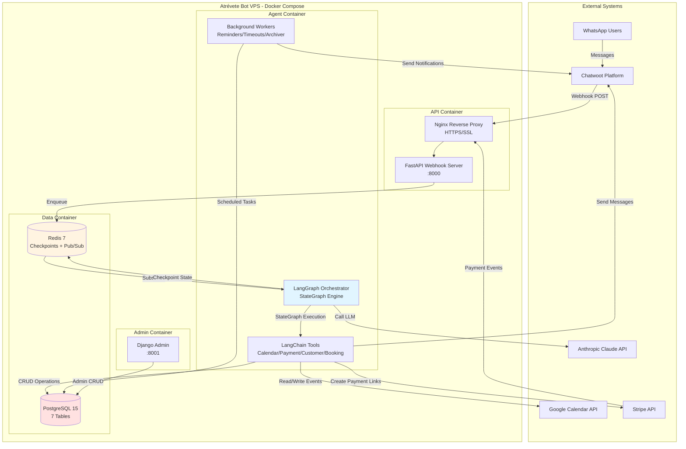
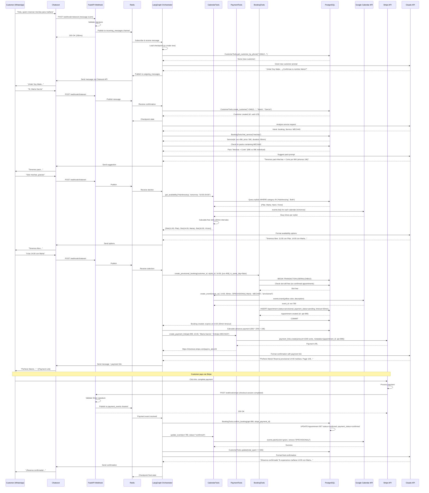

# Atrévete Bot Fullstack Architecture Document

## Introduction

This document outlines the complete fullstack architecture for **Atrévete Bot**, including backend systems, frontend implementation, and their integration. It serves as the single source of truth for AI-driven development, ensuring consistency across the entire technology stack.

This unified approach combines what would traditionally be separate backend and frontend architecture documents, streamlining the development process for modern fullstack applications where these concerns are increasingly intertwined.

The system is designed to automate 85%+ of customer reservation conversations via WhatsApp through an AI conversational agent ("Maite") powered by LangGraph + Anthropic Claude, handling the complete reservation lifecycle from initial inquiry through payment processing (via Stripe) to automated reminders—across 18 documented conversational scenarios. The architecture implements intelligent escalation to the human team via WhatsApp group notifications for complex cases, ensuring the bot augments rather than replaces human judgment.

### 1.1 Starter Template or Existing Project

**N/A - Greenfield project**

This is a greenfield implementation with no existing starter templates. The architecture is custom-designed to meet the specific requirements of a salon reservation automation system with stateful conversational AI orchestration.

### 1.2 Change Log

| Date | Version | Description | Author |
|------|---------|-------------|--------|
| 2025-10-23 | v1.0 | Initial architecture document creation | Winston (Architect Agent) |
| 2025-10-28 | v1.1 | Epic 1 implementation deviations documented | Development Team |

### 1.3 Epic 1 Implementation Notes

During Epic 1 implementation (Foundation & Core Infrastructure), **18 architectural changes** were made that deviate from the original v1.0 specifications. All changes have been documented following BMAD (Behavior, Measure, Act, Document) methodology.

**Summary of Key Changes**:
- ✅ **9 Positive Improvements**: Docker 4-service architecture, Python 3.12 upgrade, Pydantic Settings, comprehensive logging, health check enhancements
- ✅ **3 Critical Fixes** (2025-10-28): Agent coverage exclusion removed, Redis version pinned to 7.4.0-v0, RDB persistence configured
- ⚠️ **2 Architectural Limitations**: AsyncRedisSaver lifecycle coupling, Django dependency bloat (deferred to Epic 7)
- ✅ **4 Infrastructure Refinements**: PostgreSQL system dependencies, database models in API container, early escalation config

**Documentation**:
All 18 changes are fully documented in `/docs/bmad/` with detailed analysis:
- **BMAD 1.0**: Epic 1 implementation overview
- **BMAD 1.0a-1.0b**: Logging strategy, AsyncRedisSaver lifecycle
- **BMAD 1.1a-1.1c**: Python 3.12, Pydantic Settings, PostgreSQL deps
- **BMAD 1.2a-1.2e**: Docker 4-service, health checks, Redis config
- **BMAD 1.3a**: Agent test coverage fix
- **BMAD 1.4a**: Early escalation config
- **BMAD 1.5a-1.5d**: AsyncRedisSaver patterns, Redis Stack, Chatwoot API fixes
- **BMAD 1.6a-1.6b**: Django dependency, test organization

**Impact on This Document**:
Sections 2-15 reflect the **as-implemented** architecture (post-Epic 1). Key differences from original v1.0:
- **Section 2.4**: Now documents 4-service architecture (postgres, redis, api, agent) instead of 3
- **Section 3**: Python 3.12.3 (not 3.11), Redis Stack 7.4.0-v0 (pinned), Pydantic Settings
- **Section 6.1**: AsyncRedisSaver lifecycle pattern documented
- **Section 7**: Comprehensive JSON logging strategy

**Epic 2 Readiness**: ✅ All 3 critical blockers resolved, foundation solid for Customer Identification & Conversational Foundation.

---

## 2. High Level Architecture

### 2.1 Technical Summary

Atrévete Bot implements a **stateful conversational AI architecture** deployed as a monolithic application across 3 specialized Docker containers. The backend leverages **LangGraph 0.6.7+** for orchestrating complex multi-step conversational flows with automatic checkpointing, integrated with **Anthropic Claude** (Sonnet 4) for natural language understanding and reasoning. The system uses **FastAPI** for async webhook handling (Chatwoot/Stripe), **PostgreSQL** for relational data persistence, and **Redis** for hot-state management and pub/sub messaging. WhatsApp serves as the primary customer interface via **Chatwoot**, while a lightweight **Django Admin** interface enables salon staff to manage business data (services, packs, policies, holidays). The architecture implements atomic transaction-based booking with provisional calendar blocks, Stripe-hosted payment processing, intelligent escalation to human team members, and automated reminder/timeout workers. This design achieves the PRD's 85%+ automation goal by combining LangGraph's stateful orchestration capabilities with defensive concurrency controls, comprehensive error handling, and crash-recovery mechanisms—all while maintaining <5s response times for standard queries and 99.5% uptime.

### 2.2 Platform and Infrastructure Choice

**Platform:** VPS (Virtual Private Server) with Docker Compose
**Provider Recommendation:** Hetzner Cloud, DigitalOcean, or Linode
**Key Services:**
- **Compute:** 4GB RAM / 2 vCPU VPS (CPX21 equivalent)
- **Storage:** 50GB SSD for PostgreSQL data and logs
- **Networking:** HTTPS via Nginx reverse proxy with Let's Encrypt SSL
- **Backups:** Daily PostgreSQL backups to object storage (S3/Spaces)
- **Monitoring:** Self-hosted (Prometheus/Grafana) or cloud (BetterStack/UptimeRobot)

**Deployment Host and Regions:** Europe (Germany/Netherlands) for GDPR compliance and low latency to Spain (Europe/Madrid timezone)

### 2.3 Repository Structure

**Structure:** Monorepo with organized folder structure

**Monorepo Tool:** None (simple folder structure sufficient for MVP; consider Nx/Turborepo if expanding to multi-language/multi-app)

**Package Organization:** Logical separation by layer (api, agent, database, admin) with shared dependencies in root `requirements.txt`

### 2.4 High Level Architecture Diagram



### 2.5 Architectural Patterns

- **Stateful Agent Orchestration (LangGraph StateGraph):** Core orchestration pattern for 18 conversational scenarios with automatic checkpointing, conditional routing, and crash recovery - _Rationale:_ Enables complex multi-step flows with branching logic (pack suggestions, escalation, timeouts) while maintaining conversation context across crashes/restarts; superior to manual state machines for AI-driven workflows

- **Event-Driven Messaging (Redis Pub/Sub):** Decouples webhook receivers from agent processing via asynchronous message queues - _Rationale:_ Webhooks must return 200 OK immediately (<3s) while LangGraph conversations can take 5-10s; pub/sub enables fast webhook acks and scalable async processing

- **Repository Pattern (SQLAlchemy ORM):** Abstract data access logic through dedicated tool classes (CustomerTools, BookingTools) - _Rationale:_ Enables testing with mocked databases, future migration flexibility (e.g., PostgreSQL → CockroachDB), and clean separation between business logic (LangGraph nodes) and persistence

- **Two-Phase Commit for Bookings (Provisional → Confirmed):** Atomic state transitions with timeout-based rollback - _Rationale:_ Prevents double-booking race conditions by creating provisional Google Calendar blocks with 30min TTL, upgrading to confirmed only after payment webhook validation; implements optimistic locking without distributed transactions

- **Intelligent Escalation with Human-in-the-Loop:** LangGraph interrupt mechanism pauses bot, notifies team via WhatsApp, and sets Redis flag to prevent bot re-entry - _Rationale:_ Medical consultations, payment failures, and ambiguity require human judgment; interrupt pattern enables graceful handoff without losing conversation context

- **Tool-Augmented LLM (ReAct Pattern):** Claude reasons about which tools to call based on conversation state, with LangGraph enforcing deterministic control flow - _Rationale:_ Balances flexibility (LLM chooses calendar slots, suggests packs) with safety (payment flows follow strict node sequences); reduces hallucination risk by grounding responses in real data

- **Backend for Frontend (Admin Panel):** Django Admin serves as lightweight BFF for salon staff CRUD operations - _Rationale:_ Auto-generated forms reduce development time; read-only calendar views prevent accidental conflicts with bot-managed bookings; staff don't need direct database access

- **Defensive Concurrency Control (Atomic DB Transactions):** PostgreSQL row-level locking for appointment writes with serializable isolation - _Rationale:_ Concurrent customers booking same slot require atomic checks (is slot still free?) and writes (create provisional block); prevents double-booking without distributed locks

---

## 3. Tech Stack

This is the **DEFINITIVE** technology selection for the entire project. All development must use these exact versions. This table is the single source of truth for dependencies.

### 3.1 Technology Stack Table

| Category | Technology | Version | Purpose | Rationale |
|----------|-----------|---------|---------|-----------|
| **Frontend Language** | Python | 3.11+ | Admin panel templates (Django) | Type hints, async/await, performance improvements over 3.10; Django 5.0+ requires 3.10+ |
| **Frontend Framework** | Django Admin | 5.0+ | Staff admin interface | Auto-generated CRUD forms reduce development time by 80%; built-in authentication; read-only views for calendar |
| **UI Component Library** | Django Admin Default Theme | 5.0 (built-in) | Admin UI components | Sufficient for MVP; no custom design needed; responsive out-of-box |
| **State Management** | Django Session Framework | 5.0 (built-in) | Admin user sessions | Server-side session management for staff authentication; secure by default |
| **Backend Language** | Python | 3.11+ | API, Agent, Workers | Async/await native support for FastAPI; LangGraph/LangChain ecosystem; type safety with Pydantic 2.0+ |
| **Backend Framework** | FastAPI | 0.116.1 | Webhook API server | Async-native for high concurrency; automatic OpenAPI docs; Pydantic validation; <3s webhook response times |
| **API Style** | REST (webhooks) | N/A | Chatwoot/Stripe webhooks | Industry standard for webhook integrations; no GraphQL needed for simple event-driven flows |
| **Database** | PostgreSQL | 15+ | Primary data store (7 tables) | ACID compliance for booking atomicity; JSONB for metadata; pg_trgm for fuzzy service search; timezone support |
| **Cache** | Redis | 7.0+ | LangGraph checkpoints + Pub/Sub | In-memory speed (<5ms) for hot state; persistence via RDB snapshots; pub/sub for async messaging; TTL for state expiration |
| **File Storage** | Local Filesystem | N/A | Logs and backups | No user-uploaded files; logs rotate to `/var/log/`; PostgreSQL dumps to local → S3/Spaces daily |
| **Authentication** | Django Authentication | 5.0 (built-in) | Admin panel auth | Username/password for staff; no customer auth needed (WhatsApp handles identity) |
| **Frontend Testing** | N/A | N/A | No frontend tests | Admin panel is auto-generated; manual QA sufficient for CRUD forms |
| **Backend Testing** | pytest + pytest-asyncio | 8.3.0 / 0.24.0 | Unit & integration tests | Async test support for FastAPI/LangGraph; fixture-based testing; 85%+ coverage target |
| **E2E Testing** | pytest with mocked APIs | 8.3.0 | 18 scenario tests | Mock external APIs (Stripe, Google, Chatwoot) to test full conversation flows; deterministic test execution |
| **Build Tool** | pip | 24.0+ | Dependency management | Standard Python package manager; requirements.txt for reproducible builds |
| **Bundler** | N/A | N/A | No JS bundling | Django Admin serves pre-bundled static assets; no custom frontend build step |
| **IaC Tool** | Docker Compose | 2.20+ | Infrastructure definition | Multi-container orchestration (api, agent, data); environment parity dev/prod; simple deployment |
| **CI/CD** | GitHub Actions | N/A | Automated testing & deployment | Free for public repos; pytest + linting on PRs; deploy via SSH to VPS on main branch merge |
| **Monitoring** | LangSmith (optional) + Structured Logs | N/A / Python logging | LangGraph tracing + system logs | LangSmith for conversation flow debugging; JSON logs for error tracking; BetterStack/Grafana for prod |
| **Logging** | Python logging (JSON formatter) | 3.11 (stdlib) | Application logs | Structured JSON logs (timestamp, level, message, context); 14-day rotation; stderr to Docker logs |
| **CSS Framework** | Django Admin Default CSS | 5.0 (built-in) | Admin panel styling | No custom CSS needed; responsive grid; accessible by default (WCAG AA) |
| **Agent Orchestration** | LangGraph | 0.6.7+ | Stateful conversation flows | StateGraph for 18 scenarios; automatic checkpointing; conditional routing; human-in-the-loop support; crash recovery |
| **LLM Integration** | LangChain + LangChain-Anthropic | 0.3.0+ / 0.3.0+ | Tool abstraction + Claude SDK | LangChain @tool decorator for 5 tool categories; langchain-anthropic for Claude Sonnet 4 integration |
| **LLM Provider** | Anthropic Claude API | SDK 0.40.0+ | Natural language reasoning | Claude Sonnet 4 for cost/performance balance; 200k token context; tool use native; Spanish fluency |
| **ORM** | SQLAlchemy | 2.0+ | Database abstraction | Async support; type-safe queries; migration support via Alembic; repository pattern implementation |
| **Database Migrations** | Alembic | 1.13.0+ | Schema version control | Auto-generate migrations from SQLAlchemy models; rollback support; seed data scripts |
| **HTTP Client** | httpx | 0.27.0+ | External API calls | Async HTTP client for Google/Stripe/Chatwoot; connection pooling; retry logic |
| **Task Queue** | Redis Pub/Sub + asyncio | 7.0+ / 3.11 stdlib | Background workers | Lightweight pub/sub for reminders/timeouts; no Celery overhead; asyncio for in-process workers |
| **Payment Processing** | Stripe API | Python SDK 10.0+ | Payment links & webhooks | PCI-compliant hosted checkout; webhook signature validation; refund API; test mode for development |
| **Calendar Integration** | Google Calendar API | google-api-python-client 2.150+ | Event management | Service account auth; read/write events; multi-calendar support; timezone handling |
| **WhatsApp Integration** | Chatwoot API | httpx (no official SDK) | Message sending/receiving | Self-hosted or cloud Chatwoot; webhook for incoming messages; REST API for outgoing; conversation management |

---

## 4. Data Models

This section defines the core data models/entities shared between frontend and backend. These models form the conceptual foundation before implementing database schemas.

### 4.1 Customer

**Purpose:** Represents salon customers (new and returning) with their contact information, preferences, and booking history.

**Key Attributes:**
- `id`: UUID - Primary identifier
- `phone`: string - E.164 format (e.g., "+34612345678"), unique, indexed
- `first_name`: string - Customer's given name
- `last_name`: string (optional) - Customer's surname (collected before first payment)
- `created_at`: datetime - Account creation timestamp (Europe/Madrid timezone)
- `last_service_date`: datetime (nullable) - Most recent completed appointment
- `preferred_stylist_id`: UUID (nullable) - FK to Stylist, for "lo de siempre" logic
- `total_spent`: decimal - Cumulative revenue from confirmed appointments
- `metadata`: JSONB - Flexible storage for conversation preferences, referral source

#### TypeScript Interface

```typescript
interface Customer {
  id: string; // UUID
  phone: string; // E.164 format
  first_name: string;
  last_name: string | null;
  created_at: string; // ISO 8601
  last_service_date: string | null; // ISO 8601
  preferred_stylist_id: string | null; // UUID
  total_spent: number; // Decimal as float
  metadata: {
    whatsapp_name?: string;
    referred_by_customer_id?: string;
    communication_preferences?: string[];
  };
}
```

#### Relationships

- **One-to-Many with Appointments:** Customer can have multiple appointments (history and future)
- **Many-to-One with Stylist:** Customer may prefer one stylist (optional relationship)
- **Self-Referential (Referrals):** metadata.referred_by_customer_id links to another Customer for third-party bookings

---

### 4.2 Stylist

**Purpose:** Represents salon professionals providing services, each with their own Google Calendar and service category specialization.

**Key Attributes:**
- `id`: UUID - Primary identifier
- `name`: string - Stylist's full name (e.g., "Pilar", "Marta")
- `category`: enum - Service category: "Hairdressing" | "Aesthetics" | "Both"
- `google_calendar_id`: string - Unique Google Calendar ID for event management
- `is_active`: boolean - Whether stylist is currently accepting bookings
- `metadata`: JSONB - Working hours, skills, notification preferences

#### TypeScript Interface

```typescript
type ServiceCategory = "Hairdressing" | "Aesthetics" | "Both";

interface Stylist {
  id: string; // UUID
  name: string;
  category: ServiceCategory;
  google_calendar_id: string; // e.g., "pilar@atrevete.com"
  is_active: boolean;
  metadata: {
    working_hours?: { [day: string]: { start: string; end: string } };
    notification_email?: string;
    notification_phone?: string;
  };
}
```

#### Relationships

- **One-to-Many with Appointments:** Stylist provides multiple appointments
- **One-to-Many with Customers (Preferences):** Multiple customers may prefer this stylist

---

### 4.3 Service

**Purpose:** Represents individual salon services with pricing, duration, and advance payment requirements.

**Key Attributes:**
- `id`: UUID - Primary identifier
- `name`: string - Service name (e.g., "MECHAS", "Corte de pelo")
- `category`: enum - "Hairdressing" | "Aesthetics"
- `duration_minutes`: integer - Service duration (e.g., 60)
- `price_euros`: decimal - Full service price (e.g., 45.00)
- `requires_advance_payment`: boolean - Whether 20% anticipo is needed
- `description`: text - Service details for customer inquiries

#### TypeScript Interface

```typescript
interface Service {
  id: string; // UUID
  name: string;
  category: ServiceCategory;
  duration_minutes: number; // Integer
  price_euros: number; // Decimal as float
  requires_advance_payment: boolean;
  description: string;
}
```

#### Relationships

- **Many-to-Many with Appointments:** Appointments can include multiple services (e.g., "Corte + Color")
- **Many-to-Many with Packs:** Services can belong to multiple package deals

---

### 4.4 Pack

**Purpose:** Represents discounted service packages (e.g., "Mechas + Corte" for €80 instead of €90).

**Key Attributes:**
- `id`: UUID - Primary identifier
- `name`: string - Pack name (e.g., "Mechas + Corte")
- `included_service_ids`: array<UUID> - List of services in the pack
- `duration_minutes`: integer - Total pack duration
- `price_euros`: decimal - Discounted total price
- `description`: text - Pack description and savings explanation

#### TypeScript Interface

```typescript
interface Pack {
  id: string; // UUID
  name: string;
  included_service_ids: string[]; // Array of Service UUIDs
  duration_minutes: number;
  price_euros: number; // Discounted price
  description: string;
}
```

#### Relationships

- **Many-to-Many with Services:** Pack references multiple services via `included_service_ids`
- **One-to-Many with Appointments:** Appointments can book a pack instead of individual services

---

### 4.5 Appointment

**Purpose:** Represents booking transactions with state management (provisional → confirmed) and payment tracking.

**Key Attributes:**
- `id`: UUID - Primary identifier
- `customer_id`: UUID - FK to Customer
- `stylist_id`: UUID - FK to Stylist
- `service_ids`: array<UUID> - List of services booked (or pack reference)
- `pack_id`: UUID (nullable) - FK to Pack if booking a package
- `start_time`: datetime - Appointment start (Europe/Madrid timezone)
- `duration_minutes`: integer - Total duration
- `total_price`: decimal - Full service price
- `advance_payment_amount`: decimal - 20% anticipo (or 0 for free consultations)
- `payment_status`: enum - "pending" | "confirmed" | "refunded" | "forfeited"
- `status`: enum - "provisional" | "confirmed" | "completed" | "cancelled" | "expired"
- `google_calendar_event_id`: string (nullable) - Google Calendar event ID for updates/deletion
- `stripe_payment_id`: string (nullable) - Stripe Payment Link ID for webhook matching
- `payment_retry_count`: integer - Number of payment retry attempts (max 2)
- `reminder_sent`: boolean - Whether 48h reminder was sent
- `group_booking_id`: UUID (nullable) - Links appointments in group bookings
- `booked_by_customer_id`: UUID (nullable) - For third-party bookings (who made the booking)
- `created_at`: datetime - Record creation timestamp
- `updated_at`: datetime - Last modification timestamp

#### TypeScript Interface

```typescript
type PaymentStatus = "pending" | "confirmed" | "refunded" | "forfeited";
type AppointmentStatus = "provisional" | "confirmed" | "completed" | "cancelled" | "expired";

interface Appointment {
  id: string; // UUID
  customer_id: string;
  stylist_id: string;
  service_ids: string[]; // Array of Service UUIDs
  pack_id: string | null;
  start_time: string; // ISO 8601
  duration_minutes: number;
  total_price: number;
  advance_payment_amount: number;
  payment_status: PaymentStatus;
  status: AppointmentStatus;
  google_calendar_event_id: string | null;
  stripe_payment_id: string | null;
  payment_retry_count: number;
  reminder_sent: boolean;
  group_booking_id: string | null;
  booked_by_customer_id: string | null;
  created_at: string; // ISO 8601
  updated_at: string; // ISO 8601
}
```

#### Relationships

- **Many-to-One with Customer:** Appointment belongs to one customer
- **Many-to-One with Stylist:** Appointment assigned to one stylist
- **Many-to-Many with Services:** Appointment includes multiple services
- **Many-to-One with Pack (optional):** Appointment may use a pack
- **Self-Referential (Group Bookings):** Multiple appointments share `group_booking_id`
- **Self-Referential (Third-Party Bookings):** `booked_by_customer_id` references another customer

---

### 4.6 Policy

**Purpose:** Stores business rules and FAQ content as key-value pairs for dynamic configuration without code changes.

**Key Attributes:**
- `id`: UUID - Primary identifier
- `key`: string - Unique policy identifier (e.g., "cancellation_threshold_hours", "faq_parking")
- `value`: JSONB - Policy data (flexible schema per key)

#### TypeScript Interface

```typescript
interface Policy {
  id: string; // UUID
  key: string; // Unique key
  value: {
    // For business rules:
    threshold_hours?: number;
    payment_percentage?: number;
    timeout_minutes_standard?: number;
    timeout_minutes_same_day?: number;

    // For FAQs:
    question?: string;
    answer?: string;
    keywords?: string[];
  };
}
```

#### Relationships

- **None (Standalone):** Policy table is queried by key for configuration lookup

---

### 4.7 ConversationHistory

**Purpose:** Archives conversation messages from Redis to PostgreSQL for long-term analysis and GDPR compliance.

**Key Attributes:**
- `id`: UUID - Primary identifier
- `customer_id`: UUID - FK to Customer
- `conversation_id`: string - LangGraph thread_id (groups related messages)
- `timestamp`: datetime - Message timestamp (Europe/Madrid timezone)
- `message_role`: enum - "user" | "assistant" | "system"
- `message_content`: text - Message text or summary
- `metadata`: JSONB - Additional context (tool calls, escalation flags, node names)

#### TypeScript Interface

```typescript
type MessageRole = "user" | "assistant" | "system";

interface ConversationHistory {
  id: string; // UUID
  customer_id: string;
  conversation_id: string; // LangGraph thread_id
  timestamp: string; // ISO 8601
  message_role: MessageRole;
  message_content: string;
  metadata: {
    node_name?: string; // LangGraph node that generated message
    tool_calls?: string[]; // Tools invoked
    escalation_reason?: string;
  };
}
```

#### Relationships

- **Many-to-One with Customer:** Conversation history belongs to one customer
- **Logical Grouping:** `conversation_id` groups messages (not enforced FK)

---

## 5. API Specification

The API layer consists of REST webhook endpoints for receiving events from external systems. No customer-facing API exists—all customer interactions occur via WhatsApp through Chatwoot.

### 5.1 REST API Specification

```yaml
openapi: 3.0.0
info:
  title: Atrévete Bot Webhook API
  version: 1.0.0
  description: |
    Internal webhook API for receiving events from Chatwoot (WhatsApp messages)
    and Stripe (payment confirmations). All endpoints require signature validation.

    **Security:**
    - Chatwoot: HMAC-SHA256 signature in X-Chatwoot-Signature header
    - Stripe: Stripe-Signature header validated via stripe.Webhook.construct_event()

    **Rate Limiting:** 10 requests/minute per source IP (429 if exceeded)

servers:
  - url: https://bot.atrevete.com/api
    description: Production VPS
  - url: http://localhost:8000/api
    description: Local development

paths:
  /webhook/chatwoot:
    post:
      summary: Receive WhatsApp messages from Chatwoot
      description: |
        Webhook endpoint for incoming customer messages. Validates signature,
        extracts message content, and enqueues to Redis 'incoming_messages' channel
        for LangGraph agent processing. Returns 200 OK immediately (async processing).

      tags:
        - Webhooks

      security:
        - chatwootSignature: []

      responses:
        '200':
          description: Message received and enqueued successfully
        '401':
          description: Invalid or missing signature
        '429':
          description: Rate limit exceeded (>10 req/min)

  /webhook/stripe:
    post:
      summary: Receive payment events from Stripe
      description: |
        Webhook endpoint for Stripe payment confirmations. Validates signature,
        extracts payment metadata (appointment_id), and enqueues to Redis
        'payment_events' channel for booking confirmation workflow.

      tags:
        - Webhooks

      security:
        - stripeSignature: []

      responses:
        '200':
          description: Event received and processed
        '401':
          description: Invalid Stripe signature
        '400':
          description: Missing appointment_id in metadata

  /health:
    get:
      summary: Health check endpoint
      description: |
        Returns system health status including Redis and PostgreSQL connectivity.
        Used by monitoring systems (UptimeRobot, Docker healthcheck).

      tags:
        - System

      responses:
        '200':
          description: All systems operational
        '503':
          description: Service degraded or unavailable

components:
  securitySchemes:
    chatwootSignature:
      type: apiKey
      in: header
      name: X-Chatwoot-Signature
      description: HMAC-SHA256 signature of request body

    stripeSignature:
      type: apiKey
      in: header
      name: Stripe-Signature
      description: Stripe webhook signature (t=timestamp,v1=signature)
```

---

## 6. Components

This section defines major logical components/services across the fullstack, establishing clear boundaries and interfaces between system parts.

### 6.1 FastAPI Webhook Receiver

**Responsibility:** Receives and validates incoming HTTP webhooks from external systems (Chatwoot, Stripe), performs signature validation, rate limiting, and enqueues events to Redis for async processing.

**Key Interfaces:**
- `POST /webhook/chatwoot` - Receives WhatsApp message events
- `POST /webhook/stripe` - Receives payment confirmation/refund events
- `GET /health` - System health check endpoint

**Dependencies:**
- Redis (pub/sub channels: `incoming_messages`, `payment_events`)
- Environment secrets (CHATWOOT_SECRET, STRIPE_WEBHOOK_SECRET)

**Technology Stack:**
- FastAPI 0.116.1 with async route handlers
- Pydantic models for request validation
- Redis client (redis-py 5.0+) for message publishing
- Custom middleware for signature validation and rate limiting

---

### 6.2 LangGraph Conversation Orchestrator

**Responsibility:** Core AI agent that orchestrates 18 conversational scenarios using a StateGraph, manages conversation state with automatic checkpointing, coordinates tool execution, and implements conditional routing based on Claude's reasoning.

**Key Interfaces:**
- `process_incoming_message(conversation_id, customer_phone, message_text)` - Main entry point
- `resume_from_checkpoint(conversation_id)` - Crash recovery
- `escalate_to_human(reason, context)` - Human handoff trigger

**Dependencies:**
- Redis (checkpointing, state persistence, pub/sub subscription)
- PostgreSQL (customer data, appointments, policies via Tools)
- Anthropic Claude API (LLM reasoning)
- All 5 tool categories (Calendar, Payment, Customer, Booking, Notification)

**Technology Stack:**
- LangGraph 0.6.7+ StateGraph engine
- LangChain 0.3.0+ for tool abstraction
- langchain-anthropic 0.3.0+ for Claude Sonnet 4 integration
- Redis MemorySaver for checkpointing
- Custom ConversationState TypedDict

---

### 6.3 CalendarTools

**Responsibility:** Abstracts Google Calendar API operations including availability checks across multiple stylists, event creation/modification/deletion, holiday detection, and timezone handling.

**Key Interfaces:**
- `get_availability(service_category, date, time_range, stylist_id=None)` → List[AvailableSlot]
- `create_event(stylist_id, start_time, duration, title, status="provisional")` → event_id
- `update_event(event_id, new_start_time=None, status=None)` → success
- `delete_event(event_id)` → success
- `check_holiday(date)` → bool (detects "Festivo", "Cerrado" events)

**Dependencies:**
- Google Calendar API (service account with domain-wide delegation)
- Stylist table (google_calendar_id mapping)
- Europe/Madrid timezone configuration

**Technology Stack:**
- google-api-python-client 2.150+
- OAuth2 service account authentication
- Retry logic with exponential backoff (3 attempts)

---

### 6.4 PaymentTools

**Responsibility:** Manages Stripe payment link generation, webhook event processing, refund operations, and payment state validation.

**Key Interfaces:**
- `create_payment_link(appointment_id, amount_euros, customer_name, description)` → payment_url
- `process_payment_webhook(event_type, appointment_id, stripe_payment_id)` → success
- `refund_payment(stripe_payment_id, amount_euros)` → refund_id
- `validate_payment_status(stripe_payment_id)` → PaymentStatus

**Dependencies:**
- Stripe API (Payment Links, Refunds API)
- Appointment table (metadata injection for webhook matching)
- Redis (idempotency tracking for webhook deduplication)

**Technology Stack:**
- stripe 10.0+ Python SDK
- Webhook signature validation (stripe.Webhook.construct_event)
- Test mode support via STRIPE_SECRET_KEY env var

---

### 6.5 CustomerTools

**Responsibility:** CRUD operations for customer records including identification, profile creation, preference updates, and booking history retrieval.

**Key Interfaces:**
- `get_customer_by_phone(phone)` → Customer | None
- `create_customer(phone, first_name, last_name="", metadata={})` → Customer
- `update_customer_name(customer_id, first_name, last_name)` → success
- `update_preferences(customer_id, preferred_stylist_id)` → success
- `get_customer_history(customer_id, limit=5)` → List[Appointment]

**Dependencies:**
- PostgreSQL Customer table
- SQLAlchemy async session

**Technology Stack:**
- SQLAlchemy 2.0+ async ORM
- Phone number normalization (phonenumbers library)
- LangChain @tool decorator for LLM integration

---

### 6.6 BookingTools

**Responsibility:** Business logic for appointment management including provisional booking creation, price/duration calculations, timeout tracking, and state transitions (provisional → confirmed).

**Key Interfaces:**
- `calculate_booking_details(service_ids, pack_id=None)` → {total_price, duration, advance_payment}
- `create_provisional_booking(customer_id, stylist_id, start_time, service_ids, is_same_day)` → Appointment
- `confirm_booking(appointment_id, stripe_payment_id)` → success
- `cancel_booking(appointment_id, reason)` → {refund_triggered, amount}
- `check_timeout_status(appointment_id)` → {expired, minutes_remaining}

**Dependencies:**
- PostgreSQL (Appointment, Service, Pack tables)
- CalendarTools (for provisional event creation)
- PolicyTools (for timeout thresholds, payment percentage)

**Technology Stack:**
- SQLAlchemy transactions with SERIALIZABLE isolation
- Decimal arithmetic for price calculations
- Atomic state transitions (provisional/confirmed/cancelled)

---

### 6.7 NotificationTools

**Responsibility:** Multi-channel notification dispatch including WhatsApp messages via Chatwoot, email/SMS to stylists, and team escalation alerts.

**Key Interfaces:**
- `send_whatsapp_message(customer_phone, message_text)` → success
- `send_stylist_notification(stylist_id, message, channel="email")` → success
- `send_team_escalation(reason, conversation_context, customer_id)` → success
- `send_reminder(appointment_id)` → success (48h advance reminder)

**Dependencies:**
- Chatwoot API (for WhatsApp message sending)
- SMTP/SendGrid (for email notifications)
- Twilio (optional, for SMS notifications)
- Team WhatsApp group conversation ID (for escalations)

**Technology Stack:**
- httpx async HTTP client
- Chatwoot REST API
- Jinja2 templates for message formatting
- Retry logic with circuit breaker pattern

---

### 6.8 Background Workers

**Responsibility:** Scheduled tasks running independently of the main LangGraph flow including 48h reminders, payment timeout enforcement, provisional block cleanup, and conversation archival.

**Key Interfaces:**
- `ReminderWorker.run()` - Runs every 30 minutes, queries appointments 48h out
- `PaymentTimeoutWorker.run()` - Runs every 1 minute, checks provisional bookings
- `ConversationArchiverWorker.run()` - Runs hourly, moves Redis checkpoints to PostgreSQL

**Dependencies:**
- PostgreSQL (Appointment, ConversationHistory tables)
- Redis (checkpoint queries, TTL management)
- NotificationTools (for sending reminders and timeout warnings)

**Technology Stack:**
- Python asyncio with `asyncio.create_task()` for concurrent workers
- APScheduler 3.10+ for cron-like scheduling
- Graceful shutdown handling (SIGTERM)

---

### 6.9 Django Admin Interface

**Responsibility:** Web-based administration panel for salon staff to manage business data including services, packs, stylists, policies, and view read-only appointment calendars.

**Key Interfaces:**
- CRUD forms for Service, Pack, Stylist, Policy models
- Read-only list views for Appointment (filterable by date, stylist, status)
- Holiday blocking form (creates "Cerrado" events in all calendars)

**Dependencies:**
- PostgreSQL (all 7 tables)
- Django authentication (User model for staff login)

**Technology Stack:**
- Django 5.0+ Admin framework
- Django ORM (wraps SQLAlchemy models)
- Default admin theme (responsive, WCAG AA compliant)
- No custom JavaScript (uses Django's built-in admin.js)

---

## 7. Core Workflows

This section illustrates key system workflows using sequence diagrams to show component interactions, including external APIs, error handling paths, and async operations.

### 7.1 Standard Booking Flow (Scenario 1: New Customer Booking)



---

## 8. Database Schema

This section transforms the conceptual data models into concrete PostgreSQL database schemas with indexes, constraints, and relationships.

### 8.1 SQL DDL Schema

```sql
-- Enable UUID extension for primary keys
CREATE EXTENSION IF NOT EXISTS "uuid-ossp";
CREATE EXTENSION IF NOT EXISTS "pg_trgm"; -- Fuzzy text search for services

-- Set default timezone for all timestamp operations
SET timezone = 'Europe/Madrid';

-- ============================================================================
-- ENUM TYPES
-- ============================================================================

CREATE TYPE service_category AS ENUM ('Hairdressing', 'Aesthetics', 'Both');
CREATE TYPE payment_status AS ENUM ('pending', 'confirmed', 'refunded', 'forfeited');
CREATE TYPE appointment_status AS ENUM ('provisional', 'confirmed', 'completed', 'cancelled', 'expired');
CREATE TYPE message_role AS ENUM ('user', 'assistant', 'system');

-- ============================================================================
-- CORE BUSINESS ENTITIES
-- ============================================================================

CREATE TABLE stylists (
    id UUID PRIMARY KEY DEFAULT uuid_generate_v4(),
    name VARCHAR(100) NOT NULL,
    category service_category NOT NULL,
    google_calendar_id VARCHAR(255) NOT NULL UNIQUE,
    is_active BOOLEAN NOT NULL DEFAULT true,
    metadata JSONB DEFAULT '{}',
    created_at TIMESTAMP WITH TIME ZONE NOT NULL DEFAULT NOW(),
    updated_at TIMESTAMP WITH TIME ZONE NOT NULL DEFAULT NOW()
);

CREATE INDEX idx_stylists_category ON stylists(category) WHERE is_active = true;
CREATE INDEX idx_stylists_google_calendar ON stylists(google_calendar_id);

-- ----------------------------------------------------------------------------

CREATE TABLE customers (
    id UUID PRIMARY KEY DEFAULT uuid_generate_v4(),
    phone VARCHAR(20) NOT NULL UNIQUE, -- E.164 format: +34612345678
    first_name VARCHAR(100) NOT NULL,
    last_name VARCHAR(100), -- Optional until first payment
    created_at TIMESTAMP WITH TIME ZONE NOT NULL DEFAULT NOW(),
    last_service_date TIMESTAMP WITH TIME ZONE,
    preferred_stylist_id UUID REFERENCES stylists(id) ON DELETE SET NULL,
    total_spent NUMERIC(10, 2) NOT NULL DEFAULT 0.00,
    metadata JSONB DEFAULT '{}'
);

CREATE UNIQUE INDEX idx_customers_phone ON customers(phone);
CREATE INDEX idx_customers_preferred_stylist ON customers(preferred_stylist_id);
CREATE INDEX idx_customers_last_service ON customers(last_service_date DESC NULLS LAST);

-- ----------------------------------------------------------------------------

CREATE TABLE services (
    id UUID PRIMARY KEY DEFAULT uuid_generate_v4(),
    name VARCHAR(200) NOT NULL,
    category service_category NOT NULL,
    duration_minutes INTEGER NOT NULL CHECK (duration_minutes > 0),
    price_euros NUMERIC(10, 2) NOT NULL CHECK (price_euros >= 0),
    requires_advance_payment BOOLEAN NOT NULL DEFAULT true,
    description TEXT,
    is_active BOOLEAN NOT NULL DEFAULT true,
    created_at TIMESTAMP WITH TIME ZONE NOT NULL DEFAULT NOW(),
    updated_at TIMESTAMP WITH TIME ZONE NOT NULL DEFAULT NOW()
);

CREATE INDEX idx_services_category ON services(category) WHERE is_active = true;
CREATE INDEX idx_services_name_trgm ON services USING gin (name gin_trgm_ops); -- Fuzzy search

-- ----------------------------------------------------------------------------

CREATE TABLE packs (
    id UUID PRIMARY KEY DEFAULT uuid_generate_v4(),
    name VARCHAR(200) NOT NULL,
    included_service_ids UUID[] NOT NULL, -- Array of service UUIDs
    duration_minutes INTEGER NOT NULL CHECK (duration_minutes > 0),
    price_euros NUMERIC(10, 2) NOT NULL CHECK (price_euros > 0),
    description TEXT,
    is_active BOOLEAN NOT NULL DEFAULT true,
    created_at TIMESTAMP WITH TIME ZONE NOT NULL DEFAULT NOW(),
    updated_at TIMESTAMP WITH TIME ZONE NOT NULL DEFAULT NOW()
);

CREATE INDEX idx_packs_service_ids ON packs USING gin (included_service_ids);

-- ============================================================================
-- TRANSACTIONAL TABLES
-- ============================================================================

CREATE TABLE appointments (
    id UUID PRIMARY KEY DEFAULT uuid_generate_v4(),
    customer_id UUID NOT NULL REFERENCES customers(id) ON DELETE CASCADE,
    stylist_id UUID NOT NULL REFERENCES stylists(id) ON DELETE RESTRICT,
    service_ids UUID[] NOT NULL, -- Array of service UUIDs
    pack_id UUID REFERENCES packs(id) ON DELETE SET NULL,
    start_time TIMESTAMP WITH TIME ZONE NOT NULL,
    duration_minutes INTEGER NOT NULL CHECK (duration_minutes > 0),
    total_price NUMERIC(10, 2) NOT NULL CHECK (total_price >= 0),
    advance_payment_amount NUMERIC(10, 2) NOT NULL DEFAULT 0.00 CHECK (advance_payment_amount >= 0),
    payment_status payment_status NOT NULL DEFAULT 'pending',
    status appointment_status NOT NULL DEFAULT 'provisional',
    google_calendar_event_id VARCHAR(255), -- Nullable until event created
    stripe_payment_id VARCHAR(255), -- Nullable for free consultations
    payment_retry_count INTEGER NOT NULL DEFAULT 0 CHECK (payment_retry_count >= 0),
    reminder_sent BOOLEAN NOT NULL DEFAULT false,
    group_booking_id UUID, -- Links related appointments
    booked_by_customer_id UUID REFERENCES customers(id) ON DELETE SET NULL, -- For third-party bookings
    created_at TIMESTAMP WITH TIME ZONE NOT NULL DEFAULT NOW(),
    updated_at TIMESTAMP WITH TIME ZONE NOT NULL DEFAULT NOW()
);

CREATE INDEX idx_appointments_customer ON appointments(customer_id);
CREATE INDEX idx_appointments_stylist ON appointments(stylist_id);
CREATE INDEX idx_appointments_start_time ON appointments(start_time);
CREATE INDEX idx_appointments_status ON appointments(status);
CREATE INDEX idx_appointments_stripe_payment ON appointments(stripe_payment_id) WHERE stripe_payment_id IS NOT NULL;
CREATE INDEX idx_appointments_group_booking ON appointments(group_booking_id) WHERE group_booking_id IS NOT NULL;
CREATE INDEX idx_appointments_reminder_pending ON appointments(start_time, reminder_sent)
    WHERE status = 'confirmed' AND reminder_sent = false;

-- ----------------------------------------------------------------------------

CREATE TABLE policies (
    id UUID PRIMARY KEY DEFAULT uuid_generate_v4(),
    key VARCHAR(100) NOT NULL UNIQUE,
    value JSONB NOT NULL,
    description TEXT,
    created_at TIMESTAMP WITH TIME ZONE NOT NULL DEFAULT NOW(),
    updated_at TIMESTAMP WITH TIME ZONE NOT NULL DEFAULT NOW()
);

CREATE UNIQUE INDEX idx_policies_key ON policies(key);

-- ----------------------------------------------------------------------------

CREATE TABLE conversation_history (
    id UUID PRIMARY KEY DEFAULT uuid_generate_v4(),
    customer_id UUID NOT NULL REFERENCES customers(id) ON DELETE CASCADE,
    conversation_id VARCHAR(255) NOT NULL, -- LangGraph thread_id
    timestamp TIMESTAMP WITH TIME ZONE NOT NULL DEFAULT NOW(),
    message_role message_role NOT NULL,
    message_content TEXT NOT NULL,
    metadata JSONB DEFAULT '{}'
);

CREATE INDEX idx_conversation_customer ON conversation_history(customer_id);
CREATE INDEX idx_conversation_thread ON conversation_history(conversation_id, timestamp);
CREATE INDEX idx_conversation_timestamp ON conversation_history(timestamp DESC);

-- ============================================================================
-- TRIGGERS FOR AUTOMATIC TIMESTAMP UPDATES
-- ============================================================================

CREATE OR REPLACE FUNCTION update_updated_at_column()
RETURNS TRIGGER AS $$
BEGIN
    NEW.updated_at = NOW();
    RETURN NEW;
END;
$$ language 'plpgsql';

CREATE TRIGGER update_stylists_updated_at BEFORE UPDATE ON stylists
    FOR EACH ROW EXECUTE FUNCTION update_updated_at_column();

CREATE TRIGGER update_customers_updated_at BEFORE UPDATE ON customers
    FOR EACH ROW EXECUTE FUNCTION update_updated_at_column();

CREATE TRIGGER update_services_updated_at BEFORE UPDATE ON services
    FOR EACH ROW EXECUTE FUNCTION update_updated_at_column();

CREATE TRIGGER update_packs_updated_at BEFORE UPDATE ON packs
    FOR EACH ROW EXECUTE FUNCTION update_updated_at_column();

CREATE TRIGGER update_appointments_updated_at BEFORE UPDATE ON appointments
    FOR EACH ROW EXECUTE FUNCTION update_updated_at_column();

CREATE TRIGGER update_policies_updated_at BEFORE UPDATE ON policies
    FOR EACH ROW EXECUTE FUNCTION update_updated_at_column();
```

---

## 9. Frontend Architecture

The frontend for Atrévete Bot is minimal by design. Customer interactions occur exclusively via WhatsApp (handled by Chatwoot), and staff management uses Django Admin's auto-generated interface. No custom frontend application (React/Vue) is required for MVP.

### 9.1 Component Architecture

Django Admin uses auto-generated ModelAdmin forms. No custom frontend components required.

### 9.2 State Management Architecture

Django Admin uses server-side session management (built-in). No client-side state (React/Vue stores) required.

---

## 10. Backend Architecture

The backend implements the core business logic through three architectural layers: API (webhook receivers), Agent (LangGraph orchestration), and Workers (background tasks).

### 10.1 Service Architecture - Agent Container (Stateful Architecture)

Atrévete Bot uses a **stateful agent architecture** (not serverless) running as a long-lived Python process in a Docker container.

#### 10.1.1 ConversationState Schema (TypedDict)

```python
# agent/state/schemas.py
from typing import TypedDict, List, Optional, Literal
from datetime import datetime
from uuid import UUID

class ConversationState(TypedDict, total=False):
    # Conversation metadata
    conversation_id: str  # LangGraph thread_id
    customer_phone: str   # E.164 format

    # Customer context
    customer_id: Optional[UUID]
    customer_name: Optional[str]
    is_returning_customer: bool
    customer_history: List[dict]  # Last 5 appointments
    preferred_stylist_id: Optional[UUID]

    # Message management
    messages: List[dict]  # Recent 10 messages (HumanMessage, AIMessage)
    conversation_summary: Optional[str]  # Compressed history after 15+ messages

    # Intent classification
    current_intent: Optional[Literal[
        "booking", "modification", "cancellation",
        "faq", "indecision", "usual_service", "escalation"
    ]]

    # Booking context
    requested_services: List[UUID]  # Service IDs
    suggested_pack_id: Optional[UUID]
    pack_accepted: bool
    selected_date: Optional[str]  # ISO 8601 date
    selected_time: Optional[str]  # HH:MM format
    selected_stylist_id: Optional[UUID]
    available_slots: List[dict]  # {time, stylist_id, stylist_name}

    # Provisional booking tracking
    provisional_appointment_id: Optional[UUID]
    appointment_expires_at: Optional[datetime]
    payment_link_url: Optional[str]
    payment_retry_count: int

    # Group booking context
    is_group_booking: bool
    group_size: int
    group_appointment_ids: List[UUID]

    # Third-party booking
    is_third_party_booking: bool
    third_party_name: Optional[str]
    third_party_customer_id: Optional[UUID]

    # Escalation tracking
    escalated: bool
    escalation_reason: Optional[Literal[
        "medical_consultation", "payment_failure",
        "ambiguity", "delay_notice", "manual_request"
    ]]
    clarification_attempts: int

    # Node execution tracking
    last_node: Optional[str]
    error_count: int

    # Metadata
    created_at: datetime
    updated_at: datetime
```

---

## 11. Unified Project Structure

```plaintext
atrevete-bot/
├── .github/                              # CI/CD workflows
│   └── workflows/
│       ├── test.yml                      # Run tests on PR
│       ├── lint.yml                      # Code quality checks
│       └── deploy.yml                    # Deploy to VPS on main merge
│
├── api/                                  # FastAPI webhook receiver
│   ├── __init__.py
│   ├── main.py                           # FastAPI app entry point
│   ├── routes/
│   │   ├── __init__.py
│   │   ├── chatwoot.py                   # POST /webhook/chatwoot
│   │   ├── stripe.py                     # POST /webhook/stripe
│   │   └── health.py                     # GET /health
│   ├── middleware/
│   │   ├── __init__.py
│   │   ├── signature_validation.py      # Webhook signature verification
│   │   └── rate_limiting.py             # Redis-based rate limiter
│   └── models/
│       ├── __init__.py
│       ├── chatwoot_webhook.py          # Pydantic request models
│       └── stripe_webhook.py
│
├── agent/                                # LangGraph orchestrator
│   ├── __init__.py
│   ├── main.py                           # Agent entry point + Redis subscriber
│   ├── graphs/
│   │   ├── __init__.py
│   │   └── conversation_flow.py         # Main StateGraph definition
│   ├── state/
│   │   ├── __init__.py
│   │   └── schemas.py                   # ConversationState TypedDict
│   ├── nodes/
│   │   ├── __init__.py
│   │   ├── identification.py            # identify_customer, load_history
│   │   ├── classification.py            # classify_intent, detect_indecision
│   │   ├── availability.py              # check_availability, suggest_pack
│   │   ├── booking.py                   # create_provisional, confirm_booking
│   │   ├── payment.py                   # handle_payment, check_timeout
│   │   ├── modification.py              # modify_appointment, reschedule
│   │   ├── cancellation.py              # cancel_booking, process_refund
│   │   └── escalation.py                # escalate_to_human
│   ├── tools/
│   │   ├── __init__.py
│   │   ├── calendar_tools.py            # Google Calendar API wrapper
│   │   ├── payment_tools.py             # Stripe API wrapper
│   │   ├── customer_tools.py            # Customer CRUD operations
│   │   ├── booking_tools.py             # Appointment business logic
│   │   └── notification_tools.py        # Chatwoot/Email/SMS
│   ├── prompts/
│   │   └── maite_system_prompt.md       # LLM system prompt
│   └── workers/
│       ├── __init__.py
│       ├── reminder_worker.py           # 48h advance reminders
│       ├── payment_timeout_worker.py    # Provisional block cleanup
│       └── conversation_archiver.py     # Redis → PostgreSQL archival
│
├── admin/                                # Django Admin interface
│   ├── __init__.py
│   ├── settings.py                       # Django settings
│   ├── urls.py                           # URL routing
│   ├── wsgi.py                           # WSGI entry point
│   ├── admin.py                          # ModelAdmin registrations
│   ├── forms.py                          # Custom form validations
│   ├── templates/
│   │   └── admin/
│   │       ├── base_site.html            # Custom branding
│   │       └── appointment_calendar.html # Read-only calendar view
│   └── static/
│       └── admin/
│           └── css/
│               └── custom.css            # Minimal styling overrides
│
├── database/                             # SQLAlchemy models + migrations
│   ├── __init__.py
│   ├── models.py                         # ORM models (7 tables)
│   ├── connection.py                     # Async engine + session factory
│   ├── alembic/                          # Alembic migration scripts
│   │   ├── versions/
│   │   ├── env.py
│   │   └── alembic.ini
│   └── seeds/
│       ├── __init__.py
│       ├── stylists.py                   # Seed 5 stylists
│       ├── services.py                   # Seed services from scenarios
│       └── policies.py                   # Seed business rules + FAQs
│
├── shared/                               # Shared utilities
│   ├── __init__.py
│   ├── config.py                         # Environment variable loading
│   ├── logging_config.py                 # Structured JSON logging setup
│   ├── redis_client.py                   # Redis connection singleton
│   └── constants.py                      # Shared enums, constants
│
├── docker/                               # Docker configurations
│   ├── Dockerfile.api                    # FastAPI container
│   ├── Dockerfile.agent                  # LangGraph + Workers container
│   ├── Dockerfile.admin                  # Django Admin container
│   ├── docker-compose.yml                # Development 3-service setup
│   ├── docker-compose.prod.yml           # Production with restart policies
│   └── nginx/
│       ├── nginx.conf                    # Reverse proxy config
│       └── ssl/                          # Let's Encrypt certificates
│
├── tests/                                # Test suite
│   ├── __init__.py
│   ├── conftest.py                       # Pytest fixtures (DB, Redis, mocks)
│   ├── unit/
│   │   ├── test_calendar_tools.py
│   │   ├── test_payment_tools.py
│   │   ├── test_customer_tools.py
│   │   └── test_booking_tools.py
│   ├── integration/
│   │   ├── test_api_webhooks.py
│   │   └── scenarios/                    # 18 scenario tests
│   │       ├── test_scenario_01_new_booking.py
│   │       ├── test_scenario_02_modification.py
│   │       ├── test_scenario_04_medical_escalation.py
│   │       └── ...
│   └── mocks/
│       ├── mock_stripe.py
│       ├── mock_google_calendar.py
│       └── mock_chatwoot.py
│
├── scripts/                              # Utility scripts
│   ├── setup_db.sh                       # Initialize PostgreSQL + run migrations
│   ├── seed_data.sh                      # Populate initial data
│   ├── backup_db.sh                      # PostgreSQL backup to S3
│   └── deploy.sh                         # SSH to VPS + docker-compose pull/up
│
├── docs/                                 # Documentation
│   ├── brief.md                          # Project brief
│   ├── prd.md                            # Product requirements
│   ├── architecture.md                   # This document
│   ├── tech-analysis.md                  # Technology evaluation
│   └── specs/
│       └── scenarios.md                  # 18 conversational scenarios
│
├── .env.example                          # Environment variable template
├── .gitignore                            # Ignore .env, __pycache__, .pytest_cache
├── requirements.txt                      # Python dependencies
├── pyproject.toml                        # Tool configs (black, ruff, mypy, pytest)
├── alembic.ini                           # Alembic migration config
├── README.md                             # Setup and deployment instructions
└── LICENSE                               # Project license
```

---

## 12. Development Workflow

### 12.1 Local Development Setup

#### Prerequisites

```bash
# Required software
python --version  # 3.11+
docker --version  # 20.10+
docker-compose --version  # 2.20+
git --version

# Install Python dependencies
python -m venv venv
source venv/bin/activate  # Linux/Mac
pip install -r requirements.txt
```

#### Initial Setup

```bash
# Clone repository
git clone https://github.com/atrevete/atrevete-bot.git
cd atrevete-bot

# Copy environment template
cp .env.example .env
# Edit .env with your API keys

# Start infrastructure
docker-compose up -d postgres redis

# Run database migrations
alembic upgrade head

# Seed initial data
python -m database.seeds.stylists
python -m database.seeds.services
python -m database.seeds.policies
```

### 12.2 Development Commands

```bash
# Start all services
docker-compose up

# Run tests
pytest tests/
pytest --cov=agent --cov=api --cov-report=html

# Code quality checks
ruff check .
ruff format .
mypy agent/ api/ admin/
```

---

## 13. Deployment Architecture

### 13.1 Deployment Strategy

**Platform:** VPS (Hetzner CPX21: 4GB RAM, 2 vCPU, ~€7/month)

**Deployment Method:** SSH + Docker Compose

### 13.2 CI/CD Pipeline

GitHub Actions workflow runs tests on PR, deploys to VPS on main branch merge.

### 13.3 Environments

| Environment | Frontend URL | Backend URL | Purpose |
|-------------|--------------|-------------|---------|
| Development | http://localhost:8001 | http://localhost:8000 | Local development |
| Production | https://admin.atrevete.com | https://api.atrevete.com | Live environment |

---

## 14. Security and Performance

### 14.1 Security Requirements

- Webhook signature validation (HMAC-SHA256 for Chatwoot, Stripe SDK verification)
- Rate limiting: 10 requests/minute per IP
- HTTPS via Nginx + Let's Encrypt
- Django Admin: 12+ char passwords, HTTP-only session cookies
- PostgreSQL connections via SSL (production)
- Environment secrets via Docker secrets or `.env` (never in code)

### 14.2 Performance Optimization

- Response Time Target: <5s for standard queries (95th percentile)
- Database: Composite indexes, connection pooling (pool_size=10)
- Caching: Redis for policies (1 hour TTL), LangGraph checkpoints (<5ms)

---

## 15. Testing Strategy

### 15.1 Testing Pyramid

```
       E2E Tests (18 scenarios)
      /                        \
  Integration Tests (API + Agent)
 /                                \
Unit Tests (Tools, Nodes, Models)
```

### 15.2 Test Organization

- **Unit Tests:** Mock external APIs (Google, Stripe, Chatwoot)
- **Integration Tests:** Real FastAPI + Redis, mocked external APIs
- **E2E Tests:** Full conversation flows (18 PRD scenarios)

---

## 16. Error Handling Strategy

- **Retry Logic:** Exponential backoff for transient API errors (3 attempts)
- **Escalation:** Permanent errors → escalate to human team with context
- **Logging:** Structured JSON logs with conversation_id/appointment_id for traceability

---

## 17. Monitoring and Observability

### 17.1 Monitoring Stack

- **Backend Monitoring:** LangSmith (LangGraph tracing) + Prometheus (system metrics)
- **Error Tracking:** Structured JSON logs → BetterStack or Grafana Loki
- **Performance Monitoring:** Prometheus + Grafana dashboards

### 17.2 Key Metrics

- Request rate (webhooks/minute)
- Error rate (API failures)
- Response time (p50, p95, p99)
- Automation rate (completed without escalation)
- Escalation rate by reason
- Appointments created/day
- Payment success rate

---

## 18. Coding Standards

### 18.1 Critical Fullstack Rules

- **Type Sharing:** Define shared types in `agent/state/schemas.py`, never duplicate
- **Environment Variables:** Access via `shared/config.py`, never direct `os.getenv()`
- **Error Handling:** All LangGraph nodes use try-except with logging
- **State Updates:** Never mutate ConversationState—return new dict for immutability
- **Database Transactions:** Multi-step operations use `async with session.begin()`
- **Tool Invocation:** Always use LangChain `@tool` decorator with Pydantic validation
- **Phone Normalization:** E.164 format via `phonenumbers` library
- **Timezone:** All datetimes use `ZoneInfo("Europe/Madrid")`
- **Webhook Validation:** Validate signatures BEFORE processing (401 on invalid)
- **Redis Keys:** Consistent patterns: `conversation:{id}:human_mode`
- **Logging:** Include `conversation_id` or `appointment_id` for traceability
- **API Retries:** Exponential backoff (3 attempts) via `tenacity` decorator

### 18.2 Naming Conventions

| Element | Convention | Example |
|---------|-----------|---------|
| API Routes | snake_case | `/webhook/chatwoot` |
| Database Tables | snake_case | `appointments` |
| Python Functions | snake_case | `get_customer_by_phone()` |
| Python Classes | PascalCase | `ConversationState` |
| LangGraph Nodes | snake_case | `identify_customer` |
| Environment Variables | SCREAMING_SNAKE_CASE | `STRIPE_SECRET_KEY` |
| Redis Keys | colon-separated | `conversation:thread-123:human_mode` |

---

**END OF ARCHITECTURE DOCUMENT**
