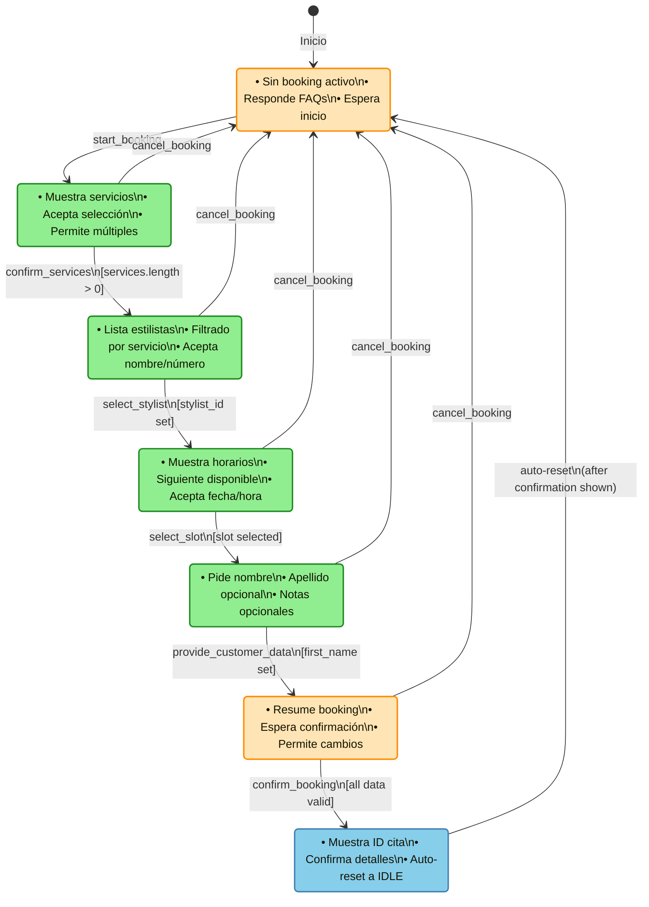

# FSM Booking Flow - Especificación Completa

**Versión:** 1.0
**Fecha:** 2025-11-21
**Autor:** Agente de Desarrollo BMAD
**Epic:** 5 - Rediseño FSM Híbrida
**Story:** 5-1 - Diseño de FSM States y Transiciones

## Tabla de Contenidos

1. [Introducción](#introducción)
2. [Estados FSM](#estados-fsm)
3. [Tipos de Intención](#tipos-de-intención)
4. [Transiciones Válidas](#transiciones-válidas)
5. [Diagrama Visual de Estados](#diagrama-visual-de-estados)
6. [Flujos de Ejemplo](#flujos-de-ejemplo)
7. [Validaciones y Reglas de Negocio](#validaciones-y-reglas-de-negocio)
8. [Referencias](#referencias)

## Introducción

Este documento define la especificación completa de la Máquina de Estados Finitos (FSM) para el flujo de booking en Atrévete Bot. La FSM controla el flujo de conversación mientras que el LLM se encarga únicamente de la interpretación del lenguaje natural (NLU) y la generación de respuestas naturales.

### Arquitectura Híbrida FSM + LLM

La arquitectura separa responsabilidades de manera clara:

```
┌──────────────┐
│ LLM (NLU)    │ ← Interpreta INTENCIÓN + Genera LENGUAJE
└──────┬───────┘
       ↓
┌──────────────┐
│ FSM Control  │ ← Controla FLUJO + Valida PROGRESO + Decide TOOLS
└──────┬───────┘
       ↓
┌──────────────┐
│ Tool Calls   │ ← Ejecuta ACCIONES validadas
└──────────────┘
```

Esta separación resuelve los bugs críticos encontrados en la arquitectura v3.2 donde el LLM controlaba tanto el flujo como la interpretación, causando problemas de estado inconsistente.

## Estados FSM

### BookingState Enum

```python
class BookingState(str, Enum):
    """Estados del flujo de booking."""
    IDLE = "idle"                               # Sin booking activo
    SERVICE_SELECTION = "service_selection"     # Seleccionando servicios
    STYLIST_SELECTION = "stylist_selection"     # Seleccionando estilista
    SLOT_SELECTION = "slot_selection"           # Seleccionando horario
    CUSTOMER_DATA = "customer_data"             # Recopilando datos cliente
    CONFIRMATION = "confirmation"               # Confirmando booking
    BOOKED = "booked"                          # Booking completado
```

### Descripción Detallada de Estados

#### IDLE
- **Descripción:** Estado inicial sin booking activo
- **Datos requeridos para entrar:** Ninguno (estado inicial por defecto)
- **Datos requeridos para salir:** Intent de tipo `start_booking`
- **Datos producidos:** Ninguno
- **Acciones permitidas:**
  - Responder preguntas generales (FAQ)
  - Iniciar nuevo booking
  - Saludar
  - Consultar disponibilidad sin booking

#### SERVICE_SELECTION
- **Descripción:** Usuario está seleccionando servicios para su cita
- **Datos requeridos para entrar:** Intent `start_booking`
- **Datos requeridos para salir:**
  - Al menos un servicio seleccionado en `services[]`
  - Intent `confirm_services`
- **Datos producidos:** Lista de servicios seleccionados (`services[]`)
- **Acciones permitidas:**
  - Mostrar catálogo de servicios
  - Agregar servicio a la selección
  - Eliminar servicio de la selección
  - Confirmar servicios seleccionados
  - Cancelar booking

#### STYLIST_SELECTION
- **Descripción:** Usuario está seleccionando el estilista para su cita
- **Datos requeridos para entrar:**
  - Lista de servicios no vacía (`services[]`)
  - Intent `confirm_services`
- **Datos requeridos para salir:**
  - Estilista seleccionado (`stylist_id`)
  - Intent `select_stylist`
- **Datos producidos:** ID del estilista seleccionado (`stylist_id`)
- **Acciones permitidas:**
  - Mostrar lista de estilistas disponibles
  - Seleccionar estilista por nombre o número
  - Ver información del estilista
  - Cancelar booking

#### SLOT_SELECTION
- **Descripción:** Usuario está seleccionando el horario para su cita
- **Datos requeridos para entrar:**
  - Servicios seleccionados (`services[]`)
  - Estilista seleccionado (`stylist_id`)
  - Intent `select_stylist`
- **Datos requeridos para salir:**
  - Slot seleccionado con fecha y hora (`slot`)
  - Intent `select_slot`
- **Datos producidos:** Slot con información de fecha, hora y duración
- **Acciones permitidas:**
  - Mostrar horarios disponibles
  - Seleccionar slot por número o descripción
  - Solicitar más opciones de horarios
  - Cambiar fecha de búsqueda
  - Cancelar booking

#### CUSTOMER_DATA
- **Descripción:** Recopilando datos del cliente para la reserva
- **Datos requeridos para entrar:**
  - Servicios, estilista y slot seleccionados
  - Intent `select_slot`
- **Datos requeridos para salir:**
  - Al menos `first_name` proporcionado
  - Intent `provide_customer_data`
- **Datos producidos:** Datos del cliente (`first_name`, `last_name` opcional, `notes` opcional)
- **Acciones permitidas:**
  - Solicitar nombre del cliente
  - Solicitar apellido (opcional)
  - Solicitar notas adicionales (opcional)
  - Validar datos ingresados
  - Cancelar booking

#### CONFIRMATION
- **Descripción:** Mostrando resumen y esperando confirmación final
- **Datos requeridos para entrar:**
  - Todos los datos previos completos
  - `first_name` del cliente
  - Intent `provide_customer_data`
- **Datos requeridos para salir:**
  - Confirmación explícita del usuario
  - Intent `confirm_booking`
- **Datos producidos:** Ninguno (solo validación)
- **Acciones permitidas:**
  - Mostrar resumen completo de la reserva
  - Confirmar reserva
  - Modificar algún dato (volver a estado anterior)
  - Cancelar booking

#### BOOKED
- **Descripción:** Booking completado exitosamente
- **Datos requeridos para entrar:**
  - Todos los datos validados
  - Intent `confirm_booking`
  - Ejecución exitosa del tool `book()`
- **Datos requeridos para salir:** Auto-reset a IDLE
- **Datos producidos:** `appointment_id` del booking creado
- **Acciones permitidas:**
  - Mostrar confirmación con detalles
  - Mostrar ID de la cita
  - Auto-transición a IDLE después de mostrar confirmación

## Tipos de Intención

### IntentType Enum

```python
class IntentType(str, Enum):
    """Tipos de intención reconocidos por el sistema."""

    # Intenciones del flujo de booking
    START_BOOKING = "start_booking"              # Iniciar proceso de reserva
    SELECT_SERVICE = "select_service"            # Seleccionar un servicio
    CONFIRM_SERVICES = "confirm_services"        # Confirmar servicios seleccionados
    SELECT_STYLIST = "select_stylist"           # Seleccionar estilista
    SELECT_SLOT = "select_slot"                 # Seleccionar horario
    PROVIDE_CUSTOMER_DATA = "provide_customer_data"  # Proporcionar datos del cliente
    CONFIRM_BOOKING = "confirm_booking"         # Confirmar reserva final
    CANCEL_BOOKING = "cancel_booking"           # Cancelar booking en progreso

    # Intenciones generales
    GREETING = "greeting"                       # Saludo inicial
    FAQ = "faq"                                 # Pregunta frecuente
    CHECK_AVAILABILITY = "check_availability"   # Consultar disponibilidad
    ESCALATE = "escalate"                      # Escalar a humano
    UNKNOWN = "unknown"                         # Intent no reconocido
```

### Descripción de Intenciones

| Intent | Descripción | Ejemplos de mensajes del usuario |
|--------|-------------|-----------------------------------|
| `START_BOOKING` | Usuario quiere iniciar una reserva | "Quiero pedir cita", "Necesito agendar", "Reservar hora" |
| `SELECT_SERVICE` | Selecciona un servicio específico | "Corte largo", "Quiero tinte", "El número 2" |
| `CONFIRM_SERVICES` | Confirma los servicios elegidos | "Eso es todo", "No, solo eso", "Sí, continuar" |
| `SELECT_STYLIST` | Elige un estilista | "Ana", "La primera", "Cualquiera está bien" |
| `SELECT_SLOT` | Elige un horario | "El lunes a las 10", "La opción 3", "Mañana por la tarde" |
| `PROVIDE_CUSTOMER_DATA` | Proporciona información personal | "María García", "Mi nombre es Juan" |
| `CONFIRM_BOOKING` | Confirma la reserva final | "Sí, confirmo", "Perfecto", "Reservar" |
| `CANCEL_BOOKING` | Cancela el proceso | "Cancelar", "No quiero continuar", "Mejor lo dejo" |
| `GREETING` | Saluda al bot | "Hola", "Buenos días", "Hey" |
| `FAQ` | Pregunta información general | "¿Qué horarios tienen?", "¿Dónde están?" |
| `CHECK_AVAILABILITY` | Consulta disponibilidad sin reservar | "¿Hay espacio mañana?", "¿Ana trabaja el sábado?" |
| `ESCALATE` | Solicita hablar con humano | "Quiero hablar con alguien", "Necesito ayuda" |
| `UNKNOWN` | No se puede determinar la intención | Mensajes ambiguos o fuera de contexto |

## Transiciones Válidas

### Matriz de Transiciones

| Estado Origen | Estado Destino | Intent Requerido | Datos Requeridos | Validaciones |
|---------------|----------------|------------------|------------------|--------------|
| IDLE | SERVICE_SELECTION | `start_booking` | - | Ninguna |
| SERVICE_SELECTION | STYLIST_SELECTION | `confirm_services` | `services[]` no vacío | Al menos 1 servicio |
| STYLIST_SELECTION | SLOT_SELECTION | `select_stylist` | `stylist_id` definido | Estilista válido |
| SLOT_SELECTION | CUSTOMER_DATA | `select_slot` | `slot` con fecha/hora | Slot disponible |
| CUSTOMER_DATA | CONFIRMATION | `provide_customer_data` | `first_name` definido | Nombre no vacío |
| CONFIRMATION | BOOKED | `confirm_booking` | Todos los datos | Validación completa |
| BOOKED | IDLE | Automática | - | Después de mostrar confirmación |
| **ANY** | IDLE | `cancel_booking` | - | Siempre permitido |

### Transiciones Especiales

#### Cancelación Universal (ANY → IDLE)
- **Trigger:** Intent `cancel_booking` desde cualquier estado
- **Acción:**
  1. Limpiar todos los datos recopilados (`collected_data`)
  2. Resetear estado a IDLE
  3. Confirmar cancelación al usuario
- **Validación:** Siempre permitida, sin condiciones

#### Auto-reset Post-Booking (BOOKED → IDLE)
- **Trigger:** Automático después de mostrar confirmación
- **Acción:**
  1. Mantener `appointment_id` en contexto por si usuario pregunta
  2. Limpiar datos de booking
  3. Estado vuelve a IDLE
- **Validación:** Automática, sin intervención del usuario

### Transiciones Inválidas (Ejemplos)

| Intento de Transición | Razón del Rechazo | Mensaje al Usuario |
|-----------------------|-------------------|-------------------|
| IDLE → CONFIRMATION | No hay datos de booking | "Primero necesitas seleccionar servicios y horario" |
| SERVICE_SELECTION → SLOT_SELECTION | Falta seleccionar estilista | "Primero elige con qué estilista quieres la cita" |
| STYLIST_SELECTION → CUSTOMER_DATA | Falta seleccionar horario | "Necesitas elegir un horario disponible" |
| CUSTOMER_DATA → BOOKED | Falta confirmación | "Por favor confirma los datos de tu reserva" |

## Diagrama Visual de Estados



### Leyenda de Colores

- 🟢 **Verde (Active):** Estados de recopilación de datos activa
- 🟡 **Amarillo (Waiting):** Estados de espera o decisión
- 🔵 **Azul (Complete):** Estado de finalización

## Flujos de Ejemplo

### Flujo 1: Happy Path - Booking Completo

| Paso | Estado FSM | Mensaje Usuario | Intent Detectado | Tool Ejecutado | Respuesta Bot |
|------|------------|-----------------|------------------|----------------|---------------|
| 1 | IDLE | "Hola, quiero pedir cita" | `start_booking` | `search_services` | "¡Hola! Te muestro nuestros servicios:\n1. Corte corto (30min)\n2. Corte largo (45min)\n3. Tinte (90min)\n¿Cuál te gustaría?" |
| 2 | SERVICE_SELECTION | "Corte largo por favor" | `select_service` | - | "Perfecto, corte largo agregado. ¿Deseas algún otro servicio?" |
| 3 | SERVICE_SELECTION | "No, solo eso" | `confirm_services` | - | "Estos son nuestros estilistas disponibles:\n1. Ana - Especialista en cortes\n2. Carmen - Colorista experta\n¿Con quién prefieres?" |
| 4 | STYLIST_SELECTION | "Con Ana" | `select_stylist` | `find_next_available` | "Los próximos horarios de Ana:\n1. Lunes 25/11 - 10:00\n2. Lunes 25/11 - 15:00\n3. Martes 26/11 - 11:00\n¿Cuál prefieres?" |
| 5 | SLOT_SELECTION | "El lunes a las 10" | `select_slot` | - | "Perfecto. ¿Me dices tu nombre para la reserva?" |
| 6 | CUSTOMER_DATA | "María García" | `provide_customer_data` | - | "Resumen de tu cita:\n👤 María García\n✂️ Corte largo\n💇‍♀️ Con Ana\n📅 Lunes 25/11 a las 10:00\n\n¿Confirmas la reserva?" |
| 7 | CONFIRMATION | "Sí, confirmo" | `confirm_booking` | `book` | "✅ ¡Cita confirmada!\nID: APT-2024-001\nTe esperamos el lunes 25/11 a las 10:00\n¡Hasta pronto!" |
| 8 | BOOKED → IDLE | (auto-reset) | - | - | (Estado listo para nueva conversación) |

### Flujo 2: Cancelación Mid-Flow

| Paso | Estado FSM | Mensaje Usuario | Intent Detectado | Tool Ejecutado | Respuesta Bot |
|------|------------|-----------------|------------------|----------------|---------------|
| 1 | IDLE | "Quiero reservar" | `start_booking` | `search_services` | "¡Claro! Estos son nuestros servicios:\n1. Corte corto\n2. Corte largo\n3. Tinte\n¿Cuál te interesa?" |
| 2 | SERVICE_SELECTION | "Tinte" | `select_service` | - | "Tinte agregado (90 min). ¿Algo más?" |
| 3 | SERVICE_SELECTION | "Mmm, mejor lo dejo para otro día" | `cancel_booking` | - | "No hay problema. Tu reserva ha sido cancelada. ¿Hay algo más en lo que pueda ayudarte?" |
| 4 | IDLE | "¿Hasta qué hora abren?" | `faq` | `query_info` | "Abrimos de lunes a sábado de 10:00 a 20:00. ¿Te gustaría agendar una cita?" |

### Flujo 3: Transición Inválida con Redirección

| Paso | Estado FSM | Mensaje Usuario | Intent Detectado | Validación FSM | Respuesta Bot |
|------|------------|-----------------|------------------|----------------|---------------|
| 1 | IDLE | "Quiero confirmar mi cita" | `confirm_booking` | ❌ No puede confirmar sin datos | "Aún no tienes una cita en proceso. ¿Te gustaría agendar una nueva cita?" |
| 2 | IDLE | "Sí, por favor" | `start_booking` | ✅ Transición válida | "Perfecto, te muestro nuestros servicios..." |

## Validaciones y Reglas de Negocio

### Validaciones por Estado

#### SERVICE_SELECTION
- **Mínimo:** Al menos 1 servicio debe ser seleccionado
- **Máximo:** No hay límite de servicios
- **Duplicados:** No permitir el mismo servicio dos veces
- **Validación:** Servicio debe existir en catálogo

#### STYLIST_SELECTION
- **Validación:** Estilista debe estar activo y disponible
- **Compatibilidad:** Estilista debe poder realizar los servicios seleccionados
- **Disponibilidad:** Debe tener al menos un slot disponible en los próximos 30 días

#### SLOT_SELECTION
- **Horario futuro:** Slot debe ser al menos 1 hora en el futuro
- **Disponibilidad:** Slot no debe estar ocupado
- **Duración:** Slot debe tener duración suficiente para todos los servicios
- **Horario laboral:** Dentro del horario de apertura del salón

#### CUSTOMER_DATA
- **Nombre requerido:** `first_name` es obligatorio
- **Apellido opcional:** `last_name` puede ser null
- **Notas opcional:** `notes` puede ser null
- **Longitud:** Nombre entre 2-50 caracteres

#### CONFIRMATION
- **Datos completos:** Todos los campos requeridos deben estar presentes
- **Consistencia:** Los datos no deben haber cambiado desde la selección
- **Disponibilidad final:** Re-validar que el slot sigue disponible

### Reglas de Negocio Globales

1. **Timeout de sesión:** Si no hay actividad en 15 minutos, FSM resetea a IDLE
2. **Un booking por vez:** Cliente no puede tener múltiples bookings en progreso
3. **Cancelación siempre permitida:** Usuario puede cancelar en cualquier momento
4. **Preservación de contexto:** Al cancelar, mantener historial de conversación
5. **Re-intentos:** Si una transición falla, permitir hasta 3 intentos con mensajes de ayuda

## Referencias

### Documentación Relacionada

- **Tech Spec Epic 5:** [docs/sprint-artifacts/tech-spec-epic-5.md](../sprint-artifacts/tech-spec-epic-5.md) - Especificación técnica completa del Epic 5
- **ADR-006:** [docs/architecture.md#ADR-006](../architecture.md#ADR-006) - Decisión arquitectónica FSM Híbrida
- **Sprint Change Proposal:** [docs/sprint-change-proposal-2025-11-21.md](../sprint-change-proposal-2025-11-21.md) - Propuesta de cambio aprobada
- **Epic 5 Definition:** [docs/epics/epic-5-rediseño-fsm-hibrida.md](../epics/epic-5-rediseño-fsm-hibrida.md) - Definición del Epic

### Código Fuente (Futuras Implementaciones)

- `agent/fsm/booking_fsm.py` - Implementación del controlador FSM (Story 5-2)
- `agent/fsm/intent_extractor.py` - Extractor de intenciones (Story 5-3)
- `agent/nodes/conversational_agent.py` - Integración FSM + LLM (Story 5-3)
- `agent/tools/*.py` - Tools con validación FSM (Story 5-4)

### Notas de Implementación

Esta especificación es la referencia autoritativa para las stories 5-2 a 5-6 del Epic 5. Cualquier desviación o cambio debe ser documentado y aprobado mediante actualización de este documento.

---

*Documento generado por Story 5-1: Diseño de FSM States y Transiciones*
*Epic 5: Rediseño FSM Híbrida para Booking Flow*