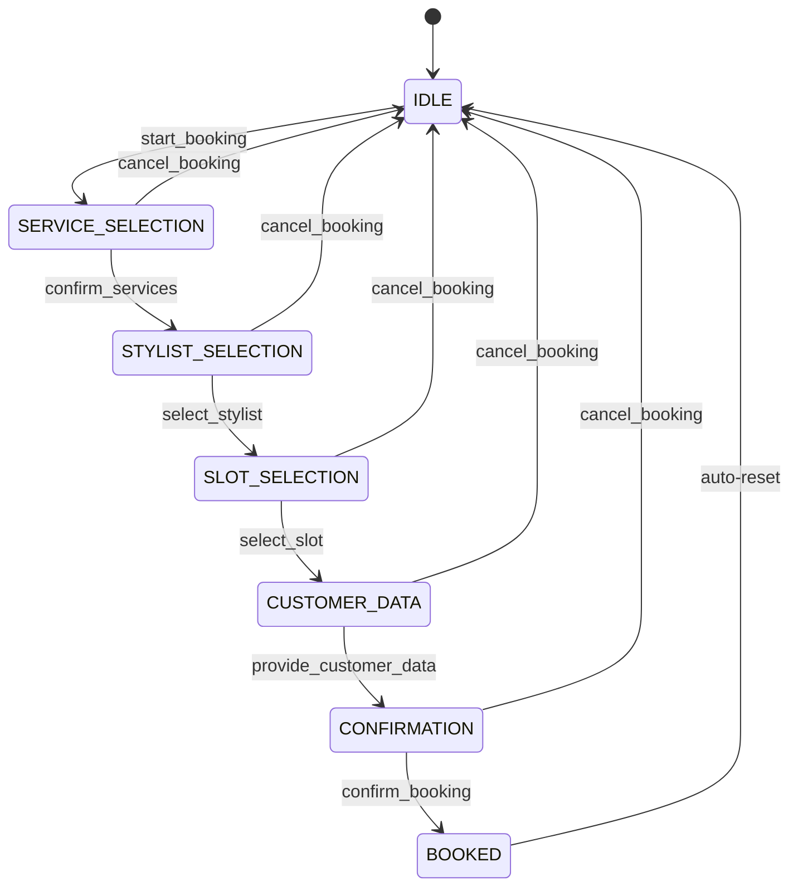

# Story 5.1: Diseño de FSM States y Transiciones

Status: done

## Story

As a **desarrollador**,
I want **una especificación completa de estados y transiciones FSM documentada**,
so that **todos los agentes de desarrollo tengan una referencia clara para implementar el BookingFSM**.

## Acceptance Criteria

1. **Given** la necesidad de documentar la FSM
   **When** se ejecuta esta story
   **Then** existe el archivo `docs/architecture/fsm-booking-flow.md` con especificación completa

2. **Given** el documento de FSM
   **When** se revisa su contenido
   **Then** contiene diagrama visual de estados y transiciones en formato Mermaid

3. **Given** cada transición definida
   **When** se documenta
   **Then** tiene condiciones de validación explícitas (datos requeridos, estado origen permitido)

4. **Given** cada estado FSM
   **When** se documenta
   **Then** tiene descripción, datos requeridos para entrar/salir, y acciones permitidas

5. **Given** el documento completo
   **When** se valida contra el Tech Spec Epic 5
   **Then** cubre los 7 estados definidos: IDLE, SERVICE_SELECTION, STYLIST_SELECTION, SLOT_SELECTION, CUSTOMER_DATA, CONFIRMATION, BOOKED

6. **Given** el documento
   **When** se incluyen ejemplos
   **Then** hay al menos 2 flujos de ejemplo: happy path y cancelación mid-flow

## Tasks / Subtasks

- [x] Task 1: Crear estructura del documento FSM (AC: #1)
  - [x] 1.1 Crear directorio `docs/architecture/` si no existe
  - [x] 1.2 Crear archivo `fsm-booking-flow.md` con estructura base

- [x] Task 2: Documentar estados FSM (AC: #4, #5)
  - [x] 2.1 Definir enum `BookingState` con 7 estados
  - [x] 2.2 Para cada estado documentar: descripción, datos requeridos, datos producidos
  - [x] 2.3 Documentar `IntentType` enum con todos los tipos de intención

- [x] Task 3: Documentar transiciones válidas (AC: #3)
  - [x] 3.1 Crear matriz de transiciones (estado origen → estado destino)
  - [x] 3.2 Para cada transición: intent requerido, datos requeridos, validaciones
  - [x] 3.3 Documentar transición especial ANY → IDLE (cancel_booking)

- [x] Task 4: Crear diagrama visual (AC: #2)
  - [x] 4.1 Crear diagrama de estados en formato Mermaid
  - [x] 4.2 Incluir condiciones de transición en el diagrama
  - [x] 4.3 Agregar leyenda de colores/estilos

- [x] Task 5: Documentar flujos de ejemplo (AC: #6)
  - [x] 5.1 Happy path: booking completo de inicio a fin
  - [x] 5.2 Cancelación mid-flow: usuario cancela durante SERVICE_SELECTION
  - [x] 5.3 Tabla paso a paso con estado, mensaje, intent, respuesta

- [x] Task 6: Validación y referencias cruzadas (AC: #1-6)
  - [x] 6.1 Verificar alineación con Tech Spec Epic 5 section "Data Models"
  - [x] 6.2 Agregar referencias a ADR-006 en architecture.md
  - [x] 6.3 Review final del documento

## Dev Notes

### Contexto Arquitectónico

Esta story implementa **AC1** del Epic 5 Tech Spec: "FSM States y Transiciones Documentadas". El documento producido será la referencia autoritativa para Stories 5-2 a 5-6.

**Referencia primaria:** [Source: docs/sprint-artifacts/tech-spec-epic-5.md#Detailed-Design]

### Estados FSM a Documentar

| Estado | Descripción | Datos Requeridos |
|--------|-------------|------------------|
| IDLE | Sin booking activo | - |
| SERVICE_SELECTION | Seleccionando servicios | - |
| STYLIST_SELECTION | Seleccionando estilista | services[] |
| SLOT_SELECTION | Seleccionando horario | services[], stylist_id |
| CUSTOMER_DATA | Recopilando datos | services[], stylist_id, slot |
| CONFIRMATION | Confirmando booking | services[], stylist_id, slot, customer_data |
| BOOKED | Booking completado | appointment_id |

[Source: docs/sprint-artifacts/tech-spec-epic-5.md#BookingState-Enum]

### Transiciones Válidas a Documentar

```
IDLE → SERVICE_SELECTION (intent: start_booking)
SERVICE_SELECTION → STYLIST_SELECTION (intent: confirm_services, services[] not empty)
STYLIST_SELECTION → SLOT_SELECTION (intent: select_stylist, stylist_id set)
SLOT_SELECTION → CUSTOMER_DATA (intent: select_slot, slot set)
CUSTOMER_DATA → CONFIRMATION (intent: provide_customer_data, first_name set)
CONFIRMATION → BOOKED (intent: confirm_booking, all data valid)
ANY → IDLE (intent: cancel_booking)
```

[Source: docs/sprint-artifacts/tech-spec-epic-5.md#Valid-Transitions]

### IntentTypes a Documentar

```python
class IntentType(str, Enum):
    # Booking flow
    START_BOOKING = "start_booking"
    SELECT_SERVICE = "select_service"
    CONFIRM_SERVICES = "confirm_services"
    SELECT_STYLIST = "select_stylist"
    SELECT_SLOT = "select_slot"
    PROVIDE_CUSTOMER_DATA = "provide_customer_data"
    CONFIRM_BOOKING = "confirm_booking"
    CANCEL_BOOKING = "cancel_booking"

    # General
    GREETING = "greeting"
    FAQ = "faq"
    CHECK_AVAILABILITY = "check_availability"
    ESCALATE = "escalate"
    UNKNOWN = "unknown"
```

[Source: docs/sprint-artifacts/tech-spec-epic-5.md#IntentType-Enum]

### Formato del Diagrama Mermaid



### Project Structure Notes

- Nuevo directorio: `docs/architecture/` (crear si no existe)
- Archivo a crear: `docs/architecture/fsm-booking-flow.md`
- Referencias existentes:
  - `docs/architecture.md` - ADR-006 ya documentado
  - `docs/sprint-artifacts/tech-spec-epic-5.md` - Especificación técnica

### Testing Standards

Esta story es **solo documentación**, no requiere tests automatizados. La validación es por **review** del documento contra el Tech Spec Epic 5.

### References

- [Source: docs/sprint-artifacts/tech-spec-epic-5.md] - Tech Spec completo del Epic 5
- [Source: docs/architecture.md#ADR-006] - Decisión arquitectónica FSM Híbrida
- [Source: docs/sprint-change-proposal-2025-11-21.md] - Propuesta de cambio aprobada

## Dev Agent Record

### Context Reference

- `docs/sprint-artifacts/5-1-diseno-fsm-states-transiciones.context.xml`

### Agent Model Used

claude-opus-4-1-20250805

### Debug Log References

- Iniciado implementación de Story 5-1 como primera story ready-for-dev en Epic 5
- Documento FSM creado con especificación completa según Tech Spec Epic 5
- Todos los acceptance criteria cumplidos en un único documento comprehensivo

### Completion Notes List

✅ Documento FSM completo creado en `docs/architecture/fsm-booking-flow.md`
✅ Los 7 estados documentados con descripciones detalladas y datos requeridos
✅ IntentType enum con 13 tipos de intención documentados
✅ Matriz de transiciones válidas completa con validaciones
✅ Diagrama Mermaid visual incluido con leyenda de colores
✅ 3 flujos de ejemplo: happy path, cancelación mid-flow, y transición inválida
✅ Referencias cruzadas a Tech Spec Epic 5, ADR-006 y documentación relacionada
✅ Validaciones y reglas de negocio documentadas por estado

### File List

- **Created:** `docs/architecture/` (directory)
- **Created:** `docs/architecture/fsm-booking-flow.md`
- **Modified:** `docs/sprint-artifacts/5-1-diseno-fsm-states-transiciones.md`
- **Modified:** `docs/sprint-artifacts/sprint-status.yaml`

### Change Log

- **2025-11-21:** Story completada - Documento FSM completo con 7 estados, transiciones, diagramas y ejemplos
- **2025-11-21:** Senior Developer Review notes appended

---

## Senior Developer Review (AI)

### Reviewer
Pepe (via Claude Code)

### Date
2025-11-21

### Outcome
**APPROVE** - Story completada satisfactoriamente. Todos los acceptance criteria cumplidos con evidencia verificada.

### Summary
La Story 5-1 de documentación FSM ha sido implementada de manera comprehensiva. El documento `docs/architecture/fsm-booking-flow.md` contiene una especificación completa y detallada que servirá como referencia autoritativa para las stories 5-2 a 5-6 del Epic 5.

El documento incluye:
- Especificación completa de los 7 estados FSM
- 13 tipos de intención documentados
- Matriz de transiciones con validaciones explícitas
- Diagrama Mermaid funcional con leyenda de colores
- 3 flujos de ejemplo detallados
- Reglas de negocio y validaciones por estado
- Referencias cruzadas a documentación existente

### Key Findings

**No se encontraron hallazgos negativos.** La implementación cumple con todos los requisitos especificados.

### Acceptance Criteria Coverage

| AC# | Descripción | Status | Evidence |
|-----|-------------|--------|----------|
| AC1 | Archivo `docs/architecture/fsm-booking-flow.md` existe con especificación completa | ✅ IMPLEMENTED | `docs/architecture/fsm-booking-flow.md:1-392` |
| AC2 | Diagrama visual de estados en formato Mermaid | ✅ IMPLEMENTED | `docs/architecture/fsm-booking-flow.md:252-290` |
| AC3 | Condiciones de validación explícitas por transición | ✅ IMPLEMENTED | `docs/architecture/fsm-booking-flow.md:210-248` (Matriz + Transiciones Especiales) |
| AC4 | Cada estado con descripción, datos requeridos, acciones permitidas | ✅ IMPLEMENTED | `docs/architecture/fsm-booking-flow.md:60-163` (Descripción Detallada de Estados) |
| AC5 | Cubre los 7 estados: IDLE, SERVICE_SELECTION, STYLIST_SELECTION, SLOT_SELECTION, CUSTOMER_DATA, CONFIRMATION, BOOKED | ✅ IMPLEMENTED | `docs/architecture/fsm-booking-flow.md:48-58` (BookingState Enum) |
| AC6 | Al menos 2 flujos de ejemplo: happy path y cancelación mid-flow | ✅ IMPLEMENTED | `docs/architecture/fsm-booking-flow.md:298-328` (3 flujos: Happy Path, Cancelación, Transición Inválida) |

**Summary: 6 of 6 acceptance criteria fully implemented**

### Task Completion Validation

| Task | Marked As | Verified As | Evidence |
|------|-----------|-------------|----------|
| Task 1.1: Crear directorio docs/architecture/ | ✅ Complete | ✅ VERIFIED | Directory exists |
| Task 1.2: Crear archivo fsm-booking-flow.md | ✅ Complete | ✅ VERIFIED | `docs/architecture/fsm-booking-flow.md` exists |
| Task 2.1: Definir enum BookingState con 7 estados | ✅ Complete | ✅ VERIFIED | `docs/architecture/fsm-booking-flow.md:48-58` |
| Task 2.2: Documentar estados con datos requeridos | ✅ Complete | ✅ VERIFIED | `docs/architecture/fsm-booking-flow.md:60-163` |
| Task 2.3: Documentar IntentType enum | ✅ Complete | ✅ VERIFIED | `docs/architecture/fsm-booking-flow.md:168-207` |
| Task 3.1: Crear matriz de transiciones | ✅ Complete | ✅ VERIFIED | `docs/architecture/fsm-booking-flow.md:210-221` |
| Task 3.2: Documentar validaciones por transición | ✅ Complete | ✅ VERIFIED | `docs/architecture/fsm-booking-flow.md:212-221` |
| Task 3.3: Documentar ANY → IDLE (cancel_booking) | ✅ Complete | ✅ VERIFIED | `docs/architecture/fsm-booking-flow.md:225-231` |
| Task 4.1: Crear diagrama Mermaid | ✅ Complete | ✅ VERIFIED | `docs/architecture/fsm-booking-flow.md:252-290` |
| Task 4.2: Incluir condiciones en diagrama | ✅ Complete | ✅ VERIFIED | Condiciones como `[services.length > 0]` en líneas 259-264 |
| Task 4.3: Agregar leyenda de colores | ✅ Complete | ✅ VERIFIED | `docs/architecture/fsm-booking-flow.md:292-296` |
| Task 5.1: Happy path completo | ✅ Complete | ✅ VERIFIED | `docs/architecture/fsm-booking-flow.md:300-311` |
| Task 5.2: Cancelación mid-flow | ✅ Complete | ✅ VERIFIED | `docs/architecture/fsm-booking-flow.md:313-320` |
| Task 5.3: Tabla paso a paso | ✅ Complete | ✅ VERIFIED | Todas las tablas con columnas: Paso, Estado, Mensaje, Intent, Tool, Respuesta |
| Task 6.1: Verificar alineación con Tech Spec | ✅ Complete | ✅ VERIFIED | Estados y transiciones coinciden con tech-spec-epic-5.md |
| Task 6.2: Agregar referencias a ADR-006 | ✅ Complete | ✅ VERIFIED | `docs/architecture/fsm-booking-flow.md:374` |
| Task 6.3: Review final | ✅ Complete | ✅ VERIFIED | Documento completo y coherente |

**Summary: 17 of 17 completed tasks verified, 0 questionable, 0 false completions**

### Test Coverage and Gaps

Esta story es de **documentación únicamente** - no requiere tests automatizados según las notas de desarrollo. La validación se realiza mediante revisión del documento contra el Tech Spec Epic 5.

**Nota:** Los tests para la implementación FSM se escribirán en las stories 5-2 a 5-5.

### Architectural Alignment

✅ **Alineado con Tech Spec Epic 5:** El documento cubre todos los elementos definidos en:
- BookingState Enum (líneas 103-112 del tech-spec)
- IntentType Enum (líneas 131-149 del tech-spec)
- Transiciones válidas (líneas 302-325 del tech-spec)
- Ejemplo Happy Path (líneas 329-339 del tech-spec)

✅ **Alineado con ADR-006:** El documento referencia correctamente la decisión arquitectónica FSM Híbrida y mantiene la separación LLM (NLU) vs FSM (flujo).

### Security Notes

No aplica - Esta story es de documentación. No hay código ejecutable ni datos sensibles involucrados.

### Best-Practices and References

- **Mermaid Diagrams:** El diagrama utiliza `stateDiagram-v2` correctamente con clases CSS para estilos
- **Documentación estructurada:** Sigue el patrón de documentación técnica con tabla de contenidos, secciones claras y referencias
- **Trazabilidad:** Referencias cruzadas a Tech Spec, ADR y Epic

### Action Items

**Code Changes Required:**
- None - All acceptance criteria met

**Advisory Notes:**
- Note: El documento será la referencia autoritativa para Stories 5-2 a 5-6
- Note: Cualquier cambio futuro al diseño FSM debe actualizar este documento primero
- Note: Considerar agregar diagramas de secuencia UML si se necesita más detalle en stories futuras
